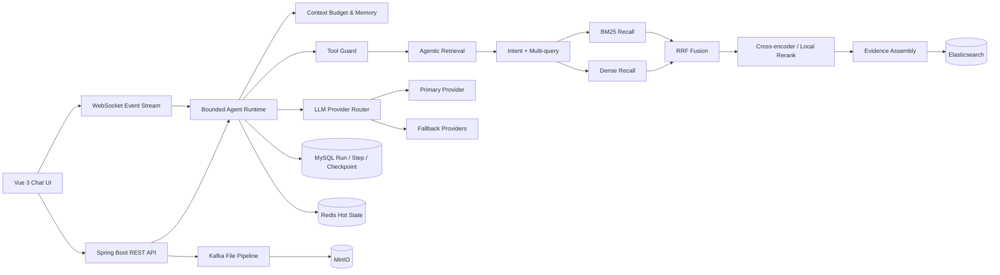

# 知枢（ZhiShu）

知枢是一套面向企业知识场景的可解释 Agentic RAG 系统。它把传统“向量检索 + LLM”升级为可规划、可评测、可恢复、可审计的知识 Agent：系统会识别查询意图，生成多路查询，同时执行 BM25 与向量召回，通过 RRF 融合和重排构建证据，并将 Agent 的步骤、检查点、成本和降级路径完整持久化。

> 原项目工程名保留为 `PaiSmart`，产品品牌统一为“知枢 / ZhiShu”。

## 核心亮点

| 能力 | 实现 |
| --- | --- |
| 查询规划 | 意图、复杂度、歧义与检索需求分类；结构化 LLM Planner 失败时规则降级 |
| Multi-query | ORIGINAL、LEXICAL、SEMANTIC、DECOMPOSED 查询变体，保留实体与约束 |
| 混合检索 | BM25 和 Dense 独立并行召回，两路执行相同的多租户权限过滤 |
| 排名融合 | Reciprocal Rank Fusion（RRF）去重融合，可配置 rank constant |
| 重排 | 可插拔 HTTP Cross-encoder，失败时切换本地轻量启发式重排 |
| 上下文工程 | 父子分块、父上下文扩展、去重、上下文预算与工具观察压缩 |
| Agent Runtime | 有界 ReAct 循环、工具注册表、超时/并发/熔断、风险分级与参数审计 |
| 持久化与恢复 | MySQL Run/Step/Checkpoint 账本，Redis 活跃事件流，跨刷新恢复和 checkpoint 重试谱系 |
| 模型韧性 | 多供应商故障转移，认证/限流/网络/5xx 分类，失败 Token 预留回滚 |
| 治理型记忆 | 带 scope、来源、置信度和生命周期的长期记忆；纠错需显式激活 |
| 离线评测 | Recall@K、MRR、nDCG、零召回率、P95 与质量门禁 |
| 可观测 UI | Agent 工作流、检索 Trace、降级原因、运行成功率/P95/步骤数和恢复率 |

## 系统架构



## Agentic Retrieval 流程

1. `QueryPlanningService` 输出结构化意图、复杂度和查询变体。
2. `AgenticRetrievalService` 在有界线程池中并行调度 BM25 与向量通道。
3. 两路候选统一按 `fileMd5 + chunkId` 去重，通过 RRF 融合排名。
4. `RerankingService` 优先调用 Cross-encoder；异常或超时时自动回退。
5. 父子分块将“检索粒度”和“生成上下文粒度”解耦。
6. 每个阶段记录输入数、输出数、耗时、降级和 traceId，并在聊天页展示。

核心代码：

- `src/main/java/com/yizhaoqi/smartpai/rag/`
- `src/main/java/com/yizhaoqi/smartpai/service/HybridSearchService.java`
- `src/main/java/com/yizhaoqi/smartpai/service/ReciprocalRankFusion.java`
- `src/main/java/com/yizhaoqi/smartpai/rag/RerankerService.java`

## 可恢复 Agent Runtime

每次请求拥有独立的 `generationId`，运行态采用事件账本设计：

- `agent_runs`：问题、状态、当前阶段、Token、答案、错误与 retry 谱系。
- `agent_steps`：可观测步骤事件、工具名称、状态和检索 metadata。
- `agent_checkpoints`：运行开始、步骤终态、恢复请求与最终状态。
- Redis：保存 30 分钟活跃生成内容和事件，用于断线续传。

服务重启时，悬空运行会进入 `INTERRUPTED`，而不是被误判为成功。用户可以从历史 checkpoint 创建新的 generation；`retryOfGenerationId` 和 `attemptNumber` 保证每次尝试独立计费、独立审计，同时保留完整谱系。

## 技术栈

后端：

- Java 17、Spring Boot 3.4、Spring Security、Spring Data JPA、WebFlux
- MySQL 8、Redis 7、Elasticsearch 8、Kafka、MinIO
- Maven、JUnit 5、Mockito、AssertJ

前端：

- Vue 3、TypeScript、Vite、Pinia、Naive UI、UnoCSS
- WebSocket 流式消息、Markdown/Shiki 渲染

## 本地启动

前置依赖：Java 17、Maven、Node.js、pnpm，以及 MySQL、Redis、Elasticsearch、Kafka、MinIO。

1. 根据 `.env.example` 或现有配置准备根目录 `.env`。
2. 启动后端：

```bash
JAVA_HOME=$(/usr/libexec/java_home -v 17) mvn spring-boot:run
```

3. 启动前端：

```bash
cd frontend
pnpm install
pnpm dev
```

4. 打开 [http://localhost:9527/#/chat](http://localhost:9527/#/chat)。后端默认监听 `8081`，前端通过 Vite 代理访问 `/api/v1`。

不要将真实 API Key、数据库密码或 JWT 提交到仓库。模型认证失败时，系统会保留运行记录、回滚 Token 预留，并提示在“模型配置”中更新凭据或启用备用供应商。

## 验证与评测

后端编译：

```bash
JAVA_HOME=$(/usr/libexec/java_home -v 17) mvn -q -DskipTests compile
```

Agentic RAG 核心测试：

```bash
JAVA_HOME=$(/usr/libexec/java_home -v 17) mvn -q \
  -Dtest=QueryPlanningServiceTest,ReciprocalRankFusionTest,RetrievalMetricsTest,\
AgentContextBudgetServiceTest,AgentToolExecutionGuardTest,AgentRunServiceTest,\
AgentMemoryServiceTest,ModelProviderConfigServiceTest test
```

黄金评测样例位于 `docs/evaluation/retrieval-golden-sample.jsonl`。评测接口支持 Recall@K、MRR、nDCG、零召回和 P95，并通过可配置门禁阻止效果回退。

## 文档

- [Agentic RAG 架构设计](docs/agentic-rag-architecture.md)
- [Agentic RAG 2.0 PRD](docs/agentic-rag-prd.md)
- [面试讲解与演示脚本](docs/agentic-rag-interview-guide.md)
- [聊天重连冒烟测试](docs/chat-reconnect-smoke-test.md)

## 项目结构

```text
src/main/java/com/yizhaoqi/smartpai/
├── rag/          # Query Planner、Agentic Retrieval、Trace
├── service/      # Agent Runtime、工具、记忆、模型路由、RRF/Rerank
├── evaluation/   # 离线检索评测与质量门禁
├── model/        # Run、Step、Checkpoint、Memory 等持久化模型
├── repository/   # JPA 数据访问
├── controller/   # REST API
└── handler/      # WebSocket 流式通信

frontend/src/
├── views/chat/   # Agent 工作流、检索 Trace、恢复与健康度 UI
├── store/        # 会话、断线恢复和运行状态
└── typings/      # 前后端 Agent 数据契约
```

## 设计原则

- 不展示隐藏思维链，只展示系统可观测事件和简洁决策摘要。
- 检索每条路径都执行多租户权限过滤，权限泄漏率目标为 0。
- 非关键增强组件必须可降级；线程池、工具调用和循环均有显式预算。
- MySQL 是审计事实来源，Redis 只承担热状态和短期续传。
- 优化必须通过离线指标、运行 Trace 和故障演示证明，而不是只增加概念名词。
