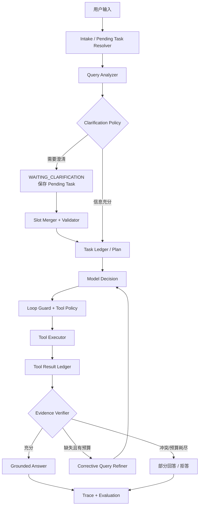

# 知枢 Agent 运行时闭环技术方案

## 1. 设计原则

1. LLM 负责语义判断，Java 负责状态、权限、预算、协议和终止。
2. Transcript 是审计事实，Model Context 是可重建视图，两者分离。
3. 每一步先产生合法 state patch，再提交 checkpoint 和事件。
4. 工具调用不是普通函数调用，而是带副作用、回放和恢复语义的协议。
5. 任何自动记忆、摘要或证据结论都必须能追溯原始来源。
6. 先实现单 Agent 的可靠闭环，再根据评测决定是否引入多 Agent。

## 2. 目标架构



## 3. Agent State

运行时新增统一、可序列化的 `AgentRuntimeState`。第一阶段以 JSON 保存到现有 checkpoint，避免一次性引入复杂图框架。

```json
{
  "schemaVersion": 1,
  "generationId": "...",
  "currentNode": "EVIDENCE_VERIFY",
  "status": "RUNNING",
  "originalQuery": "...",
  "resolvedQuery": "...",
  "queryPlan": {},
  "pendingClarification": null,
  "taskLedger": {},
  "evidenceState": {},
  "loopState": {},
  "toolLedger": [],
  "budgets": {},
  "terminalReason": null,
  "version": 12
}
```

状态更新规则：

- node 只能提交声明过的字段。
- patch 经过 schema、版本和业务不变量校验。
- step、checkpoint 与关键账本更新在同一事务内提交。
- 事件在事务提交后发布；失败可从 MySQL 重新投影到 Redis。
- model context 只保存状态摘要和 artifact 引用，不复制完整原始结果。

## 4. Evidence Verifier

### 4.1 数据模型

```java
enum EvidenceStatus {
    SUFFICIENT, PARTIAL, CONFLICTED, INSUFFICIENT
}

record EvidenceAssessment(
    EvidenceStatus status,
    double confidence,
    Set<String> coveredAspects,
    Set<String> missingAspects,
    List<EvidenceConflict> conflicts,
    String progressSignature,
    String suggestedAction
) {}
```

### 4.2 第一版算法

先采用可解释的轻量算法，避免所有问题额外调用一次 LLM：

1. 从 `QueryPlan` 获取 intent、entities、constraints 和 decomposed queries。
2. 对最终候选计算 query term coverage、entity coverage、source diversity、top score 和候选数量。
3. `COMPARE/MULTI_HOP` 要求每个实体或子问题至少有一条证据。
4. 相同主题出现高相关但内容明显互斥的片段时标记 `CONFLICTED`。
5. 规则处于灰区时才允许调用 judge 模型，并记录 `assessmentMode`。

建议动作：

- `SUFFICIENT -> ANSWER`
- `PARTIAL/INSUFFICIENT + remainingBudget -> REFINE`
- `PARTIAL/INSUFFICIENT + noBudget -> PARTIAL_ANSWER/ABSTAIN`
- `CONFLICTED -> ANSWER_WITH_CONFLICTS`

### 4.3 Corrective Retrieval

`CorrectiveQueryRefiner` 输入 missing aspects、已执行 query、已覆盖实体和失败通道，输出差异化查询。每个查询生成 fingerprint，已执行查询不得重复。

最多两轮，每轮必须满足至少一个进展条件：

- 新增证据 ID；
- 新覆盖实体或子问题；
- 冲突被解决；
- 证据状态提升。

否则由 Loop Guard 提前终止。

## 5. Clarification Protocol

### 5.1 触发策略

必须澄清：

- 缺失槽位改变知识域、租户范围或主要实体；
- 时间范围会导致结论不同且没有可信默认值；
- 涉及写操作、删除或外部副作用；
- 前两意图分数接近且属于不同业务域。

不应澄清：

- 可以安全采用最新版本等明确默认值；
- 普通知识解释不依赖缺失槽位；
- 追问收益低于一次检索试探成本。

### 5.2 Pending Task

新增 `agent_pending_task`：

```text
id, generation_id, user_id, conversation_id
status, original_query, intent
known_slots_json, missing_slots_json
question, options_json, resume_node
checkpoint_id, expires_at, created_at, updated_at
```

约束：同一用户和会话最多一个 ACTIVE Pending Task；过期后不再自动合并。

### 5.3 消息协议闭合

澄清在模型看来是一个受控工具动作：

1. assistant 发出 `ask_clarification` tool request；
2. runtime 保存 tool request 和 Pending Task；
3. 当前回合以等待事件闭合，不伪造用户回答；
4. 用户补充后生成对应 tool result；
5. Slot Merger 更新状态后继续原 checkpoint。

这样可避免 dangling tool call 破坏后续模型协议。

## 6. Task/Progress Ledger

```json
{
  "goal": "比较两个方案并给出带证据建议",
  "constraints": ["仅使用组织知识库"],
  "acceptanceCriteria": ["分别覆盖两个方案", "结论带引用"],
  "todos": [
    {"id":"t1","title":"检索方案A","status":"COMPLETED","dependencies":[],"evidenceIds":["d1"]},
    {"id":"t2","title":"检索方案B","status":"IN_PROGRESS","dependencies":[],"evidenceIds":[]}
  ],
  "blockers": [],
  "nextAction": "补充检索方案B",
  "planVersion": 2
}
```

启用条件：`complexity=COMPLEX`、多实体比较、多跳问题或预计工具调用大于一次。简单问答不创建冗余计划。

Ledger 由结构化 state patch 更新，不能让模型直接覆盖整个对象。每轮模型调用前只注入 goal、未完成 Todo、blocker 和 next action；压缩、重连和恢复后强制再水合。

## 7. Loop Guard

### 7.1 Action Fingerprint

```text
SHA-256(toolName + "\n" + canonicalJson(arguments))
```

Canonical JSON 规则：对象 key 排序、数字统一格式、字符串 trim、忽略 tool call ID 和时间戳等非语义字段。

- 第一次：正常执行。
- 第二次：允许执行但注入 `REPEAT_WARNING`，要求说明新信息预期。
- 第三次：拒绝执行，terminal reason 为 `DUPLICATE_ACTION_LIMIT`。

### 7.2 Progress Signature

```text
hash(sortedEvidenceIds, completedTodoIds, stateVersionOfFacts, normalizedErrorClass)
```

连续两轮 signature 不变且没有用户输入，视为 `NO_PROGRESS`。工具返回同一错误也计入无进展，而不是无限重试。

### 7.3 Terminal Reason

```java
enum AgentTerminalReason {
    ANSWERED,
    PARTIAL_EVIDENCE,
    INSUFFICIENT_EVIDENCE,
    CONFLICTED_EVIDENCE,
    WAITING_CLARIFICATION,
    WAITING_APPROVAL,
    DUPLICATE_ACTION_LIMIT,
    NO_PROGRESS,
    ROUND_BUDGET_EXHAUSTED,
    TOOL_BUDGET_EXHAUSTED,
    TOKEN_BUDGET_EXHAUSTED,
    USER_CANCELLED,
    RETRYABLE_FAILURE,
    FATAL_FAILURE
}
```

终止原因写入 `agent_run`、最终 checkpoint、完成事件和指标聚合。

## 8. Tool Protocol 与恢复

### 8.1 Tool Spec

```java
record ToolPolicy(
    RiskLevel riskLevel,
    ToolEffect effect,
    ConcurrencyPolicy concurrency,
    ReplayPolicy replayPolicy
) {}
```

- `ToolEffect`: `READ / GENERATE / WRITE`
- `ReplayPolicy`: `REPLAY_SAFE / AT_MOST_ONCE / REQUIRES_APPROVAL`
- `ConcurrencyPolicy`: `PARALLEL_SAFE / SERIAL_PER_RUN / SERIAL_PER_USER`

### 8.2 Tool Ledger

每次调用保存：tool call ID、action fingerprint、参数摘要、policy、状态、结果 artifact、错误分类、开始结束时间和 idempotency key。

恢复策略：

- `REPLAY_SAFE` 且已有成功结果：直接重用 ledger 结果。
- `REPLAY_SAFE` 但没有结果：允许重放。
- `AT_MOST_ONCE` 且状态成功：只复用结果。
- `AT_MOST_ONCE` 且状态未知：进入人工确认，禁止自动重放。
- `REQUIRES_APPROVAL`：恢复后重新确认权限和审批状态。

### 8.3 节点恢复

现有 `retryRun` 演进为：

1. 读取源 run 最新 checkpoint。
2. 校验 schema version、所属用户和 checkpoint checksum。
3. 修复 dangling step/tool protocol。
4. 创建新的 attempt，保存 `resumedFromCheckpointId`。
5. 从 `resumeNode` 执行，不重新做已提交节点。
6. 如果 checkpoint 不兼容，显式降级为 lineage retry，并记录原因。

## 9. 中间件生命周期

为了逐步瘦身 `ChatHandler`，定义有序 Hook：

```text
beforeRun
  -> PendingTaskResolver
  -> QueryPlanning
  -> TaskLedgerInitializer

beforeModel
  -> ContextBudget
  -> LedgerRehydration
  -> MemoryRecall
  -> PromptAssembly

afterModel
  -> OutputValidation
  -> LoopGuard

beforeTool
  -> PermissionGate
  -> ReplayResolver

afterTool
  -> ToolLedgerWriter
  -> EvidenceVerifier
  -> CheckpointWriter

afterRun
  -> TerminalStateWriter
  -> MemoryCandidateCapture
  -> TraceEvaluator
```

第一阶段不一次性重写全部聊天逻辑，先把每个闭环做成独立服务，通过清晰接口接入，再逐步迁移到 Hook Pipeline。

## 10. 评测设计

### 10.1 数据集结构

```json
{
  "id": "case-001",
  "turns": [{"role":"user","content":"..."}],
  "expected": {
    "intent": "COMPARE",
    "clarificationRequired": false,
    "relevantDocumentIds": ["..."],
    "requiredClaims": ["..."],
    "allowedTools": ["search_knowledge"],
    "terminalReasons": ["ANSWERED", "PARTIAL_EVIDENCE"]
  }
}
```

### 10.2 指标

- 查询：Intent Macro-F1、Clarification Precision/Recall/F1、Slot Merge Accuracy。
- 检索：Recall@K、MRR、nDCG、zero-recall rate。
- 证据：Evidence Status Accuracy、Citation Precision/Recall、Claim Coverage、Conflict Detection F1。
- 工具：Selection Accuracy、Argument Accuracy、Success Rate、Duplicate Action Rate。
- 轨迹：Expected Node Coverage、Invalid Transition Rate、Average Steps、No-progress Rate。
- 恢复：Resume Success Rate、Reused Step Count、Duplicate Side-effect Rate。
- 稳定性：多次运行成功率、`pass^k`、P95 延迟和成本。

### 10.3 发布门禁

- 权限泄漏和重复副作用必须为 0。
- 核心 retrieval 指标不得低于当前基线。
- 新版本 trajectory invalid transition 不得增加。
- 每个历史生产 bad case 必须进入 regression set。
- LLM-as-judge 只评开放性质量，格式、权限、状态和引用优先使用确定性 grader。

## 11. 数据库变更

优先复用现有 `agent_run / agent_step / agent_checkpoint`，新增：

- `agent_pending_task`：澄清等待状态。
- `agent_tool_call`：工具协议与回放账本。
- `agent_run.terminal_reason`。
- `agent_run.resumed_from_checkpoint_id`。
- checkpoint state JSON 增加 schema version、task ledger、evidence 和 loop state。

JPA 自动建表仅用于本地开发；部署脚本应提供显式 SQL migration，并包含索引：

- pending task `(user_id, conversation_id, status)`；
- tool call `(generation_id, action_fingerprint, status)`；
- run `(retry_of_generation_id, attempt_number)`。

## 12. 兼容与降级

- 旧 checkpoint 没有 schema version 时按 lineage retry 处理。
- Evidence Verifier 异常时返回 `PARTIAL`，保留原检索结果。
- Pending Task 存储异常时退化为普通提示，不伪装成可恢复澄清。
- Tool Ledger 不可用时只执行 `REPLAY_SAFE` 读工具；写工具拒绝执行。
- 新事件字段保持向后兼容，旧前端忽略未知字段。

## 13. 实现切片

1. 文档、枚举、状态对象和单元测试骨架。
2. Evidence Verifier、Corrective Retrieval 与 trace。
3. Pending Task、Slot Merger、API/事件和 UI。
4. Loop Guard、Terminal Reason、Task Ledger。
5. Tool Ledger、Replay Resolver 和 checkpoint resume。
6. Agent Evaluation Service、回归数据集和运行面板。

