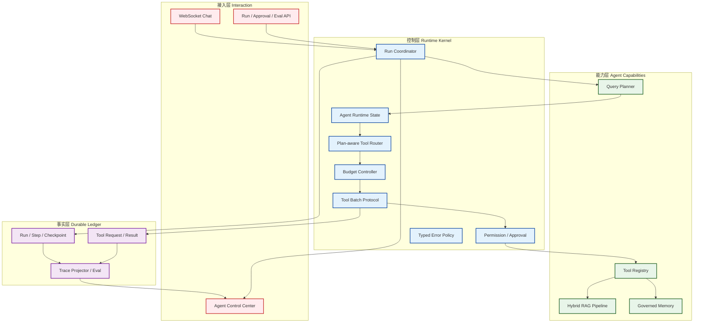
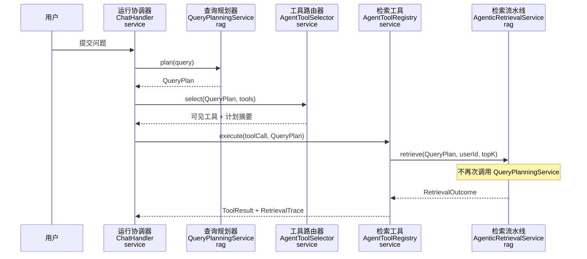
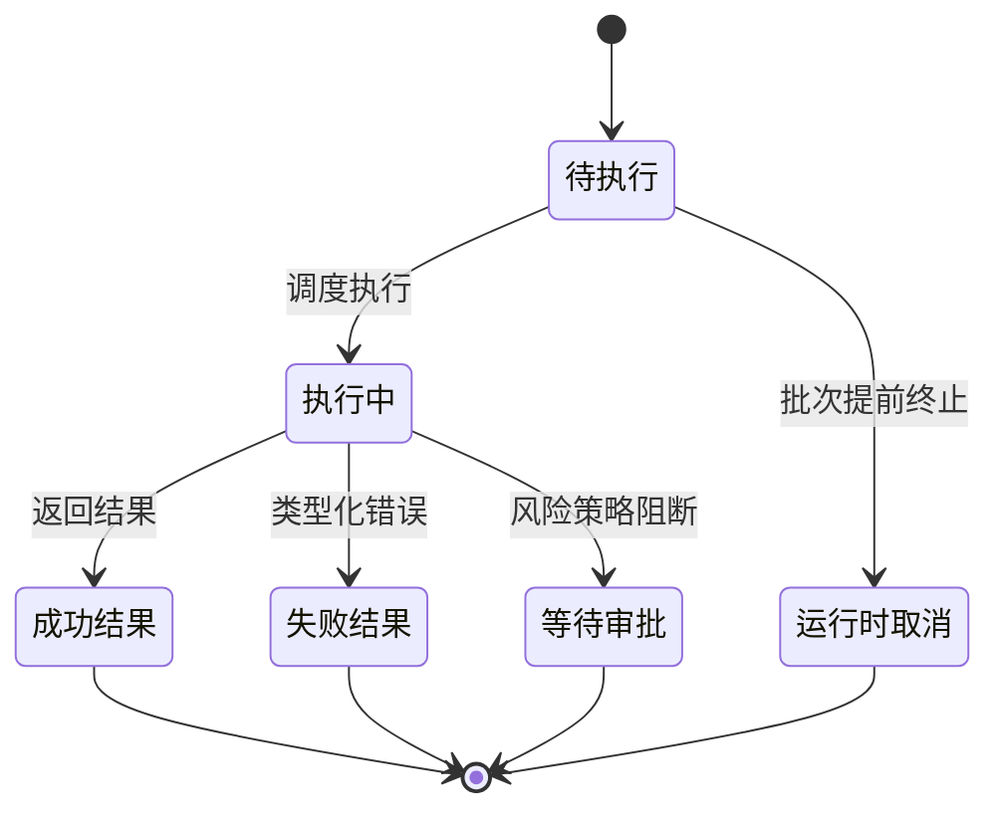

# 知枢 Agent Runtime Kernel 技术方案

## 1. 设计原则

1. 模型负责语义候选，Runtime 负责状态、权限、预算、调度和终止。
2. QueryPlan 是 Run 级不可变事实，检索层只能消费或显式派生，不能隐式重算。
3. Transcript 是审计事实，Model Context 是可重建视图。
4. Tool Call 是协议，不是普通 Java 方法调用；请求、结果、取消和审批必须成对落账。
5. 恢复从持久化状态开始，不从 Prompt 猜测“上次做到哪里”。
6. 先把单 Agent 做成可靠状态机，再根据评测决定是否增加 Multi-Agent。

## 2. 目标架构



## 3. Runtime State

第一阶段继续复用 MySQL checkpoint，以 JSON 保存统一状态；不引入外部图框架。

```json
{
  "schemaVersion": 2,
  "stateVersion": 8,
  "generationId": "run-id",
  "currentNode": "TOOL_EXECUTION",
  "status": "RUNNING",
  "queryPlan": {},
  "taskLedger": {},
  "toolCursor": 1,
  "budgets": {
    "modelTurnsUsed": 2,
    "toolCallsUsed": 1,
    "promptTokensUsed": 3200,
    "completionTokensUsed": 640,
    "startedAtEpochMs": 0
  },
  "terminalReason": null
}
```

不变量：

- `stateVersion` 单调递增。
- `WAITING_APPROVAL` 和 `WAITING_CLARIFICATION` 不占用执行线程。
- currentNode 的迁移必须经过允许的状态边。
- toolCursor 只能在对应 ToolResult 落账后推进。
- 终态不得回到 RUNNING，只能创建新的 attempt。

## 4. 单次查询规划



兼容策略：保留 `retrieve(String, userId, topK)` 给评测或非 Agent 调用；它内部规划后委托新重载。Agent 主链只调用 `retrieve(QueryPlan, ...)`。

## 5. Plan-aware Tool Router

`AgentToolSelector` 是无状态纯函数：

- `retrievalRequired=false`：移除 `search_knowledge` 与 `generate_summary`。
- `intent=SUMMARY`：只保留 `generate_summary`，避免外层搜索和工具内部搜索重复。
- 其余知识意图：保留 `search_knowledge`、反馈和统计工具。
- 后端仍在执行前重新校验，模型不可通过伪造工具名绕过。

模型每轮收到精简计划摘要：intent、complexity、entities、constraints、retrievalRequired 和剩余预算，不注入原始 Planner Prompt。

## 6. Tool Batch 协议



`AgentToolBatchExecutor` 遍历模型返回的同批工具调用。首个 TerminalReason 出现后不再执行后续调用，但必须为每个剩余 ID 生成：

```json
{
  "status": "CANCELLED_BY_RUNTIME",
  "reason": "PARTIAL_EVIDENCE",
  "message": "前序工具已触发运行时收敛，本调用未执行"
}
```

只有批次全部闭合后，才允许追加最终 user convergence message。

## 7. Runtime Budget

`AgentRunBudgetController` 使用单调时钟和累计 usage，提供两个检查点：

- `beforeModelTurn()`：检查模型轮数、总 Token、运行时间。
- `beforeToolCall()`：检查工具数、总 Token、运行时间。

配置：

```yaml
agentic-rag:
  runtime:
    max-model-turns: 4
    max-tool-calls: 8
    max-prompt-tokens: 24000
    max-completion-tokens: 8000
    max-run-seconds: 120
```

预算判断返回结构化 `BudgetDecision`，不抛通用异常。达到上限后由 Batch Protocol 为尚未执行的 tool calls 补齐取消结果。

## 8. 类型化错误

```java
record AgentToolError(
        ErrorType type,
        boolean retryable,
        String safeMessage,
        String suggestedAction,
        Integer retryAfterSeconds) {}
```

异常映射集中在 `AgentToolErrorClassifier`，模型只接收脱敏后的类型、提示和建议动作。Loop Guard 以 `errorType + actionFingerprint` 统计失败，不再 hash 可变错误字符串。

## 9. Checkpoint 与审批

- 新 checkpoint 保存完整 `AgentRuntimeStateSnapshot`，并带 schemaVersion。
- checkpoint 序列化或写入失败时，当前节点标记 `FAILED`，不能吞掉异常继续推进。
- Tool Ledger 使用数据库唯一键和冲突重读实现并发幂等，不以 Java `synchronized` 作为跨实例保证。
- 审批接口：`POST /chat/agent-runs/{generationId}/tool-approvals/{toolCallId}`，body 为 `APPROVE/REJECT`。
- 批准后创建新 attempt；拒绝后保存 ToolResult 并创建替代方案 attempt。

## 10. Eval Runner

```text
Golden Dataset
  → Agent Evaluation Runner
  → Real Agent Runs (k samples)
  → Trace Projector
  → Deterministic Metrics + Optional Judge
  → Baseline Comparator
  → Quality Gate Report
```

Trace Projector 只读取持久化 Run/Step/Tool/Checkpoint/Reference 数据。`actualIntent`、`actualTools`、`terminalReason`、恢复成功和 duplicate side effect 均不能由客户端提交。

## 11. 前端控制面

在现有消息卡片之上增加四个结构化区域：

1. Plan：目标、当前 Todo、依赖和完成进度。
2. Budget：剩余轮数、工具数、Token 和时间。
3. Evidence：查询改写、双路召回、RRF、重排、纠正轮次和证据状态。
4. Action：审批、重试、查看恢复谱系。

默认收起高级信息；运行中只突出当前步骤，避免信息噪音。所有过渡动画遵守 reduced-motion。

## 12. 测试策略

- 单元测试：Tool Selector、Batch Protocol、Budget Controller、Error Classifier、State Validator。
- 服务测试：QueryPlan 只生成一次、RAG 复用计划、审批状态迁移、checkpoint 版本恢复。
- 集成测试：MySQL 唯一键竞争、运行中断、审批后新 attempt、Trace Projector。
- 前端测试：审批卡片、预算告警、任务账本和终止原因。
- 回归：现有 Agent/RAG 定向测试必须保持通过。
