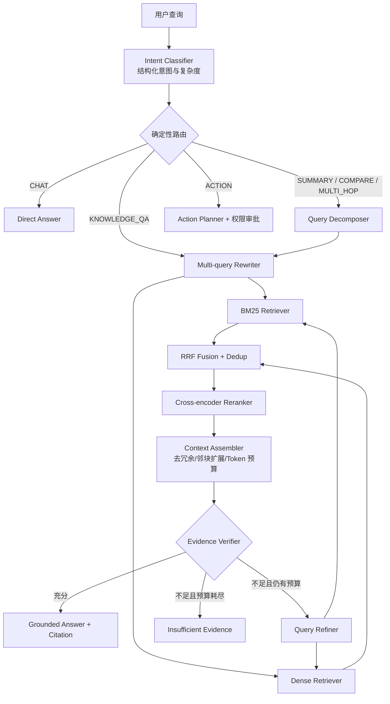

# PaiSmart Agentic RAG 2.0 架构设计

## 1. 目标

PaiSmart 的核心不再定义为“带工具调用的聊天页面”，而是一个可评测、可恢复、可学习的企业知识 Agent：

- 对查询做结构化意图识别，而不是所有问题走同一条链路。
- 对复杂查询进行受控的 Multi-query 改写和问题分解。
- BM25 与向量独立召回，保留各自排名和证据。
- 使用 RRF 融合不同分数空间的结果，再使用 reranker 精排。
- 根据证据充分性决定回答、补充检索或拒答。
- Agent 的每个节点可持久化、恢复、重放和评测。
- 长期记忆有类型、作用域、来源、置信度、版本和纠错机制。

最终需要能用消融实验回答：每一个模块带来了多少 Recall、MRR、nDCG、引用准确率和任务成功率提升。

## 2. 当前实现的问题

当前 `HybridSearchService` 在一个 Elasticsearch 请求中同时放入 KNN、关键词 must 条件和 BM25 rescore。它存在三个关键问题：

1. 向量候选必须同时命中关键词，语义召回会被词法条件提前截断。
2. KNN 分数和 BM25 分数没有形成两份独立排名，无法做真正的融合与消融。
3. 没有查询规划、重排序、证据充分性判断，也无法解释某个结果来自哪一路召回。

当前 `ChatHandler` 是固定轮数的手写 ReAct 循环，具备工具调用能力，但缺少：

- 显式的 Agent 状态与确定性路由；
- 节点级 checkpoint 和故障恢复；
- 无进展、重复动作、预算耗尽等停止条件；
- 检索质量反馈驱动的二次检索；
- 可跨会话使用、可纠错的长期记忆；
- 离线评测和链路级指标。

## 3. 总体架构



这不是让 LLM 自由决定一切的无限循环。LLM 只放在需要语义判断的节点，路由、权限、预算、并发、重试和终止全部由 Java 代码控制。

## 4. 检索流水线

### 4.1 查询意图分类

输出严格的结构化对象，不输出自然语言分析：

```json
{
  "intent": "KNOWLEDGE_QA",
  "complexity": "COMPLEX",
  "needsRetrieval": true,
  "needsDecomposition": true,
  "timeSensitive": false,
  "entities": ["RRF", "BM25"],
  "constraints": ["仅限当前知识库"],
  "confidence": 0.94
}
```

第一版意图枚举：

- `CHAT`：问候、闲聊、纯创作，不检索知识库。
- `KNOWLEDGE_QA`：事实、定义、操作说明。
- `SUMMARY`：对一个主题或文档集合归纳。
- `COMPARE`：比较多个实体，需要覆盖各自证据。
- `MULTI_HOP`：答案依赖多个片段或多个实体关系。
- `ACTION`：需要执行有副作用的工具。

分类器采用“小模型 + JSON Schema + 规则兜底”。低置信度时默认走检索，而不是默认直接回答。精确关键词、文件名、编号等信号由规则先提取，避免 LLM 改坏实体。

### 4.2 Multi-query 查询改写

不是简单生成几句同义句。输出最多 4 个有明确角色的查询：

1. `ORIGINAL`：原始查询，永远保留。
2. `SEMANTIC`：补充同义表达和领域术语。
3. `LEXICAL`：保留专有名词、编号、缩写，面向 BM25。
4. `DECOMPOSED`：复杂问题的原子子问题，可有多个。

改写必须满足：

- 原始实体和限制条件不可丢失；
- 禁止引入用户未提及的事实；
- 语义重复的查询在执行前去重；
- 简单查询只保留原始查询，避免增加延迟和噪声；
- 每个 query variant 保存 `purpose`、`parentQuery` 和 `rewriteReason`，用于评测。

### 4.3 两路独立召回

每个查询变体并行执行两路召回：

- `SparseRetriever`：Elasticsearch BM25，擅长精确词、编号、专有名词。
- `DenseRetriever`：Elasticsearch KNN，擅长同义表达和语义匹配。

两路必须使用完全相同的用户、组织、公开性权限过滤。权限在召回阶段完成，不能先全库召回再过滤，否则既有越权风险，也会导致 topK 被无权限文档占用。

建议第一版参数：

- 每个 BM25 查询召回 30 条；
- 每个向量查询召回 30 条，`numCandidates` 取 100～200；
- 融合后保留 50 条；
- reranker 精排 30～50 条，最终取 8～12 条。

参数必须通过配置和离线评测确定，不能作为硬编码“经验值”永久存在。

### 4.4 RRF 融合

对每个 `(queryVariant, retrievalChannel)` 产生的排名列表执行 RRF：

```text
RRF(d) = Σ 1 / (k + rank_i(d))
```

第一版使用 `k=60`，文档身份使用 `fileMd5 + chunkId`。RRF 的价值在于只使用排名，不直接混合 BM25 和余弦相似度这两个不可比的分数空间。

融合结果必须保留下列可解释信息：

```json
{
  "documentKey": "md5:chunkId",
  "rrfScore": 0.0612,
  "hits": [
    {"channel": "BM25", "queryType": "LEXICAL", "rank": 1},
    {"channel": "DENSE", "queryType": "ORIGINAL", "rank": 4}
  ]
}
```

第一版不引入人工权重。只有当消融实验说明某一路需要加权时，再支持 weighted RRF，防止把不可解释的调参伪装成算法能力。

### 4.5 Cross-encoder 重排序

定义稳定接口，模型实现可替换：

```java
interface Reranker {
    List<RerankedDocument> rerank(String query, List<RetrievedDocument> candidates, int topN);
}
```

推荐两种实现：

- 默认实现：云端轻量 rerank API，便于开发环境快速落地；
- 可选实现：本地 BGE reranker 的 ONNX 服务或独立 Python 推理服务，便于展示私有化部署能力。

Cross-encoder 只处理融合后的几十个候选，不参与全库召回。超时或服务不可用时 fail-open，回退到 RRF 排名，并在 trace 中记录降级原因。

### 4.6 上下文组装和证据判断

精排结果不能直接全部拼入 prompt。`ContextAssembler` 负责：

- 同文档相邻 chunk 扩展；
- 依据 `fileMd5 + pageNumber` 控制来源多样性；
- 去掉高度重复片段；
- 在 token budget 内选择证据；
- 保留页码、锚点、文件名和 chunk ID。

`EvidenceVerifier` 输出 `SUFFICIENT / PARTIAL / CONFLICTED / INSUFFICIENT`。只有证据不足且仍有检索预算时才进入 refine loop，最多 2 次。出现冲突时答案必须明确列出冲突来源，不能静默选择其中一条。

## 5. Agent Runtime

### 5.1 采用状态图，不采用无限 ReAct

借鉴 AgentLoop 的行为树黑板与 LangGraph/Spring AI Alibaba Graph 的 checkpoint 思路，但 PaiSmart 第一版实现一个轻量、领域化的 Java Runtime，核心接口如下：

```java
interface AgentNode {
    NodeResult execute(AgentContext context, AgentState state);
}

record NodeResult(
    NodeStatus status,
    String nextNode,
    Map<String, Object> statePatch,
    List<AgentEvent> events
) {}

enum NodeStatus {
    SUCCEEDED, FAILED, WAITING_APPROVAL, RETRYABLE
}
```

`AgentState` 是黑板状态，只保存可序列化内容：

- 用户目标、意图和约束；
- 查询变体和检索候选 ID；
- 证据集合与引用映射；
- 工具调用和 observation；
- token、耗时、模型调用、工具调用预算；
- 当前节点、重试次数、失败原因；
- 已检索记忆 ID，不直接复制整个记忆库。

### 5.2 Agent Loop

每一步执行顺序固定：

1. 加载最新 checkpoint；
2. 检查总预算和停止策略；
3. 执行当前节点；
4. 校验 state patch；
5. 在同一事务中保存 step 与 checkpoint；
6. 发布 Redis/SSE 事件；
7. 依据确定性 edge 选择下一节点。

停止条件至少包括：

- 最大节点数、模型调用数、工具调用数；
- 最大 wall-clock 时间与 token/cost budget；
- 同一工具和参数重复调用；
- 连续两轮证据集合没有变化；
- 已满足成功谓词；
- 需要人工批准；
- 不可恢复错误。

### 5.3 持久化模型

Redis 只保存活跃运行的事件流和短期缓存，MySQL 保存真实运行记录：

- `agent_run`：一次用户任务，记录状态、用户/租户、入口、预算、开始结束时间。
- `agent_step`：节点输入摘要、输出摘要、耗时、模型/工具、token、错误、trace ID。
- `agent_checkpoint`：每一步之后的完整可恢复状态，带版本号和校验和。

checkpoint 支持：进程重启恢复、人工审批后继续、失败节点重试、调试时从历史节点 fork。checkpoint 设置保留策略，不能无限增长。

## 6. 记忆系统

### 6.1 知识库和记忆必须分开

- 知识库是组织文档事实，强调权限、来源、页码、引用和更新流程。
- Agent 记忆是用户偏好、任务经历、纠错和运行策略，强调作用域、置信度、生命周期和可撤销。

二者可以使用相似的混合检索技术，但不能共用无边界的索引，更不能让低可信记忆覆盖知识库证据。

### 6.2 四层记忆

1. **Working Memory**：当前 `AgentState` 与 checkpoint，按 run/thread 隔离。
2. **Semantic Memory**：用户或组织的稳定事实、偏好和约束。
3. **Episodic Memory**：过去任务的目标、关键步骤、结果和用户评价，用作少样本经验。
4. **Procedural Memory**：经过审核和版本管理的技能、策略、提示词与工具使用规则。

额外建立高价值的 **Correction Memory**：它不是一条 `good/bad` 字符串，而是结构化的人类纠错记录：

```json
{
  "scope": {"tenantId": "t1", "userId": "u1", "agent": "knowledge-agent"},
  "queryFingerprint": "...",
  "intent": "COMPARE",
  "originalAnswer": "...",
  "correction": "比较时必须分别给出两个产品的版本范围",
  "affectedNode": "ANSWER_GENERATION",
  "confidence": 1.0,
  "provenance": {"runId": "...", "messageId": "..."}
}
```

规划前召回相关纠错，把它作为受约束的提示，而不是把所有历史反馈塞进 prompt。

### 6.3 写入、合并与纠错

记忆写入分两条路径：

- Hot path 只记录明确事实、用户显式偏好和人工纠错，保证立即生效。
- Background path 从完成的 run 中提取候选记忆，负责去重、合并、冲突检测和过期处理。

模型只能“提议”记忆，不能直接写入 `ACTIVE`。写入流程是：

```text
PROPOSED -> schema validation -> permission/scope check
         -> duplicate/contradiction check -> ACTIVE / QUARANTINED / REJECTED
```

每条长期记忆至少包含：

- `type`、`namespace`、`scope`；
- 结构化内容和用于检索的文本；
- `confidence`、`importance`；
- `source_run_id`、`source_message_id`、`provenance`；
- `status`、`version`、`valid_from`、`expires_at`；
- 最近使用时间、命中次数、正负反馈。

用户应能够查看、纠正、停用和删除自己的记忆。发生矛盾时不覆盖旧记录，而是保留版本与审计链。

### 6.4 记忆检索

记忆检索同样采用 metadata filter + hybrid retrieval + rerank，但在注入上下文之前还要经过：

- 用户/组织/Agent namespace 过滤；
- 状态、时效与置信度过滤；
- 与当前意图的相关性判断；
- token budget；
- prompt injection 风险检查。

始终在上下文中的只能是少量、稳定、明确的 Memory Block，例如用户语言偏好和不可违反的组织策略。其余记忆按需检索。

## 7. 可观测性与评测

页面上的 Agent 轨迹只是底层 trace 的投影。每个节点统一记录：

- 输入输出摘要与 state diff；
- 使用的模型、prompt version、工具和参数摘要；
- BM25/Dense/RRF/Rerank 各阶段候选数与文档排名变化；
- 延迟、token、费用、重试、降级原因；
- 引用到最终答案 claim 的映射。

### 7.1 离线数据集

先建立 150～300 条人工标注查询，至少覆盖：

- 精确编号、文件名、缩写；
- 同义表达和口语查询；
- 比较、总结、多跳问题；
- 无答案和证据冲突；
- 多租户权限隔离；
- 恶意文档 prompt injection；
- 用户纠错和跨会话记忆。

每条数据保存：意图标签、相关 chunk、期望引用、答案要点、是否应拒答、允许访问的租户范围。

### 7.2 指标与消融

检索指标：

- Intent Macro-F1；
- Recall@5/10/20、MRR@10、nDCG@10；
- reranker 相对 RRF 的 nDCG lift；
- 权限泄漏率，目标必须为 0。

回答与 Agent 指标：

- Faithfulness、Answer Relevancy、Citation Precision/Recall；
- 无答案识别率；
- 任务成功率、平均步骤、重复工具率；
- P50/P95 延迟、token 和成本；
- checkpoint 恢复成功率。

记忆指标：

- memory hit rate、helpfulness；
- correction reuse rate；
- stale/incorrect memory rate；
- negative transfer rate；
- 用户删除后残留率，目标必须为 0。

报告必须包含以下消融矩阵：

```text
BM25 only
Dense only
BM25 + Dense + RRF
BM25 + Dense + RRF + Reranker
+ Multi-query
+ Evidence refine loop
+ Correction memory
```

没有基准和消融结果，不能把新增模块描述为“提升了效果”。

## 8. 技术选型结论

### 自己实现

- 意图 schema、Multi-query 策略和实体保护；
- 两路独立召回、RRF、检索 trace 和上下文组装；
- 证据充分性状态机；
- 领域化 AgentState、LoopPolicy 与停止条件；
- 记忆 schema、作用域、纠错和治理；
- 离线数据集、指标和消融框架。

这些部分最能体现工程判断，也是简历和面试中可展开的核心。

### 借鉴或适配框架

- Spring AI Alibaba Graph：后续可作为通用图执行/checkpointer 适配层，不在第一阶段整体替换现有代码。
- Elasticsearch：继续承担 BM25、KNN 和过滤；RRF 第一版在应用层实现，便于保留 trace 和做消融。
- Cross-encoder：通过独立 `Reranker` 接口接云端或本地模型，不自行训练基础模型。
- Redis/SSE：承担实时事件；MySQL 承担 durable run、checkpoint 和 memory。

不直接全量迁移到现成 Agent 框架，避免项目最后只剩“调用框架 API”。等核心检索和记忆接口稳定后，再做 Spring AI Alibaba Graph adapter，能够同时展示自研内核和框架集成能力。

## 9. 实施顺序

### Phase 1：检索基线与可消融流水线

- 建立标注数据格式和离线 evaluator。
- 拆出 `SparseRetriever` 与 `DenseRetriever`。
- 完成 RRF、去重、trace 和单元测试。
- 增加 `Reranker` 接口、降级策略和 mock evaluator。
- 完成 Multi-query 与意图分类。

### Phase 2：Agentic Retrieval Loop

- 实现 `AgentState`、节点接口、确定性 edge 和预算。
- 增加 Evidence Verifier 与最多两次的 refine loop。
- MySQL 持久化 run/step/checkpoint，并支持断点恢复。

### Phase 3：长期记忆与纠错闭环

- 建立 semantic/episodic/procedural/correction memory 模型。
- 实现异步 consolidation、冲突隔离、审计和删除。
- 在规划前按 scope 检索相关记忆和纠错。

### Phase 4：产品化

- 前端展示真实节点、检索排名变化、引用和降级状态。
- 管理端提供运行回放、记忆治理和评测看板。
- 完成故障注入、权限测试、压测和面试材料。

## 10. 参考实现的取舍

- AgentLoop：借鉴行为树黑板、tick 状态、神经节点与确定性规则分离、逐步回放；不照搬其面向通用自治任务的完整引擎。
- LangGraph：借鉴 checkpointer 与跨线程 store 分离；不把 Python 运行时引入 Java 主链路。
- Spring AI Alibaba：借鉴 Graph、Loop/Routing Agent、上下文工程和 HITL；后续以 adapter 方式集成。
- Hermes Agent：借鉴每轮持久化、压缩前 memory flush、保留最近消息、工具调用和结果成对压缩、会话 lineage。
- Letta：借鉴“常驻 Memory Block / 按需文件 / archival search / 外部 RAG”的上下文层级。
- Elasticsearch + Sentence Transformers：采用独立召回、RRF 和 retrieve-then-rerank 的标准两阶段检索结构。

关键原则是：框架提供执行机制，PaiSmart 自己拥有检索策略、状态定义、记忆治理和评测证据。

## 11. 本地研究库和大厂面经复盘后的新增结论

这一节来自对本机 `Documents/研究` 与 `Documents/面经` 中 Ragent、AgentScope Java Harness、TencentDB Agent Memory、Claude Code、DeerFlow、Hermes、Pi Agent、smolagents 以及近期 Agent 面试题的交叉阅读。它补充第一版设计里仍然不足的部分。

### 11.1 意图分类要升级为“查询控制平面”

第一版只定义了意图枚举，还不够。成熟实现中的意图节点不只是 label，还应该携带执行配置：

```text
IntentNode
├── intentId / parentId / businessDomain
├── actionType: CHAT / KB / TOOL / CLARIFY
├── knowledgeScope / collection
├── allowedTools
├── promptTemplateVersion
├── retrievalProfile
├── requiredSlots
└── riskLevel
```

这样意图识别结果可以直接决定：查哪个知识域、用哪套检索参数、允许调用哪些工具、采用哪套回答协议、是否必须进行人工确认。

同时增加有状态澄清协议：

```text
Query Analyzer
  -> slots / missingSlots / ambiguity / confidence
  -> Clarification Policy
  -> Pending Task Store
  -> 用户补充信息
  -> Slot Merger
  -> Validator
  -> 恢复原运行图
```

澄清触发不能只靠模型自由判断。以下情况必须由规则控制：

- 缺失字段会改变执行路径；
- 缺失字段影响租户、知识域或时间范围；
- 涉及写操作或高风险工具；
- 意图前两名分数接近且属于不同业务域；
- 没有可信默认值。

新增 `WAITING_CLARIFICATION` Agent 状态，并把 original query、已知槽位、缺失槽位、澄清问题和恢复节点写入 checkpoint。用户下一条短回复应合并回原任务，而不是被当成一个新问题。

### 11.2 真正实现 Parent-Document Retrieval

当前 `ParseService` 的注释写了“父文档-子切片”，但父块实际只承担流式缓冲作用：系统最终只保存子 chunk，没有持久化 `parentChunkId` 和父块正文。因此当前并不是检索意义上的 Parent-Document Retrieval。

目标数据模型：

```text
DocumentVersion
  -> ParentChunk（完整章节/页面区域）
       -> ChildChunk（小粒度检索单元）
```

- 子 chunk 用于 BM25、向量召回和 rerank。
- 命中后回查父 chunk，获得更完整的生成上下文。
- 父 chunk 保存标题路径、页码范围、段落类型和版本。
- 对同一父块命中的多个子块先聚合，避免重复上下文。
- 最终引用仍指向实际命中的子块和对应页面，保证可解释。

这解决“小块适合检索、大块适合生成”的粒度冲突，比简单相邻 chunk 扩展更稳定。

### 11.3 入库质量要成为一等公民

把当前解析和向量化升级为可恢复、可观测的 Ingestion Pipeline：

```text
Fetch
  -> Parse
  -> Layout Normalize
  -> Quality Check
  -> Parent/Child Chunk
  -> Contextual Enrichment
  -> Embedding
  -> Dual Index Write
  -> Validation
  -> Publish
```

每个节点记录输入输出摘要、文档版本、耗时、错误和重试次数。重点增加：

- **Layout-aware parsing**：标题、列表、表格、代码块、图片说明不能全部退化成纯文本。
- **Chunk contextualization**：子 chunk 的 embedding 文本增加文档标题和章节路径，原文和增强文本分别保存。
- **质量门禁**：空白率、乱码率、重复率、异常短块、超长块、OCR 置信度不过关时不发布索引。
- **内容血缘**：答案引用能下钻到 document version、parent、child、页码和解析器版本。
- **增量更新**：用内容哈希定位变化的 parent，只重建受影响的 child 和 embedding。
- **删除闭环**：MySQL、Elasticsearch、MinIO 和缓存的删除状态可追踪并可补偿。

### 11.4 增加索引版本和 Embedding 蓝绿迁移

当前 `EsDocument` 已保存 `modelVersion`，模型配置服务也会阻止不安全的直接切换，这是良好基础，但还缺完整迁移能力。

增加版本化索引：

```text
knowledge_base_v1  <- active alias
knowledge_base_v2  <- rebuilding / shadow
```

迁移过程：

1. 新模型创建新索引并全量重算；
2. 黄金查询集对比 Recall、MRR、nDCG；
3. 线上 shadow query 同时请求新旧索引但只返回旧结果；
4. 比较 overlap@K、无结果率、延迟和 rerank 结果；
5. 5% -> 20% -> 100% 灰度切换 alias；
6. 指标异常立即回滚旧 alias。

同一个可服务索引中禁止长期混合不同 embedding 空间。模型升级后，RRF 参数、rerank 阈值和 TopK 也需要重新标定。

### 11.5 Context Engine：从 Prompt 拼接升级为中间件管道

借鉴 AgentScope Harness 和 DeerFlow，把上下文处理做成有序 middleware/hook，而不是散落在 `ChatHandler` 中：

```text
PreRun
  -> TaskBoundaryMiddleware
  -> IntentAndClarificationMiddleware
  -> MemoryRecallMiddleware
  -> SkillDiscoveryMiddleware
  -> RetrievalMiddleware
  -> ContextBudgetMiddleware
  -> PromptAssemblyMiddleware

PostModel / PostTool
  -> OutputValidationMiddleware
  -> ToolResultOffloadMiddleware
  -> StatePersistenceMiddleware
  -> MemoryCaptureMiddleware
  -> TraceMiddleware
```

每个 middleware 声明 order、输入字段、state patch、失败策略和是否允许降级。核心 Agent Loop 保持薄，能力通过 hook 插入。

上下文不再只有消息列表，而是：

- 当前任务目标和验收条件；
- 活跃 plan/todo；
- 最近完整消息窗口；
- 压缩摘要；
- 按需召回的知识、记忆和 Skill；
- 工具 observation 的预览与 artifact 引用；
- 权限、安全和输出协议。

### 11.6 大工具结果卸载和可逆压缩

长 Agent 任务的主要风险不仅是历史深度，还包括单个工具结果过宽。增加 `ArtifactStore`：

- 大检索候选、大 JSON、日志和文件内容保存为 artifact；
- 模型上下文只保留头尾预览、摘要、路径和校验和；
- Agent 可通过受限工具按区间重新读取原始内容；
- tool call 与 tool result 作为原子对，压缩时不可拆开；
- 压缩前先保存 checkpoint、memory candidate 和 artifact；
- 压缩后重新注入 goal、active todo、关键决策、权限和下一节点。

高层摘要必须能够下钻到原始证据，不能把不可逆摘要当作新的事实来源。

### 11.7 Session Event Sourcing 和任务分支

除 checkpoint 外，再保存 append-only 的 Agent Event Log：

```text
USER_MESSAGE
INTENT_RESOLVED
PLAN_CREATED
RETRIEVAL_STARTED
DOCUMENT_RECALLED
TOOL_REQUESTED
TOOL_COMPLETED
STATE_PATCHED
HUMAN_APPROVED
ANSWER_COMMITTED
MEMORY_PROPOSED
```

checkpoint 是恢复快照，event log 是审计事实，两者职责不同。基于 event log 可以实现：

- 从任意节点重放；
- 比较两次运行的路径差异；
- 从历史 checkpoint fork 新分支验证新 prompt/模型；
- 用户插入 steering 信息而不破坏当前状态；
- 把失败轨迹直接转为离线回归样本。

### 11.8 Skills：把成功经验变成可测试能力包

Procedural Memory 不应只是一段系统提示，而应升级为 Skill Registry。Skill 目录包含：

```text
skill-name/
├── SKILL.md
├── skill.yaml
├── references/
├── scripts/
├── examples/
└── tests/
```

运行时采用渐进式披露：

1. 规则 + BM25/向量召回 Skill metadata；
2. 轻量模型/LLM rerank 候选 Skill；
3. 只加载命中 Skill 的正文；
4. references 按需读取；
5. 确定性任务执行经过验证的 script；
6. 关键步骤通过 hard gate 和 validator 控制。

需要区分：

- Tool：一个确定动作；
- MCP：工具和资源连接协议；
- Skill：一类任务的程序性知识、工具组合、约束和验收方式；
- Workflow：系统预先固定的执行路径。

Skill 必须有版本、owner、风险等级、所需权限、依赖工具、评测集和灰度状态。人工确认的成功轨迹可以生成 `PROPOSED` Skill，但不能自动发布为 `ACTIVE`。

### 11.9 Skill 与记忆的安全供应链

一旦允许动态 Skill 和自动记忆，系统会出现新的输入面：文档、工具结果、记忆、Skill 声明都可能携带 prompt injection。

建立四个信任区：

```text
Trusted System Policy
Reviewed Skill / Procedure
Tenant Knowledge / Memory
Untrusted User / Tool / External Content
```

不同来源使用明确的 prompt delimiter 和权限，不允许低信任内容覆盖高信任指令。增加：

- 文档和记忆 prompt injection 扫描；
- 记忆写入前的来源、权限、重复和矛盾校验；
- Skill 包路径穿越、危险脚本、网络外联、依赖和密钥扫描；
- Skill 声明能力与实际工具权限的一致性检查；
- 工具 read/write 分级和最小权限；
- 高风险动作 prepare -> preview -> approve -> execute；
- 工具输出和引用内容在前端渲染前转义。

安全评测集要覆盖间接 prompt injection、跨租户记忆污染、恶意文档、危险 Skill、越权工具参数和删除后残留。

### 11.10 模型是可失败基础设施

现有多模型配置进一步升级为：

- 每个用途独立路由：generation、intent、rewrite、embedding、rerank、judge；
- `CLOSED / OPEN / HALF_OPEN` 三态熔断；
- 超时、限流、鉴权、5xx 分类型重试；
- 失败预算和 provider 健康度；
- 流式首包之前先 buffer/probe，失败可切换 provider；
- 首包之后不再透明切换，避免拼接两个模型的内容；
- 记录用户感知 TTFT，而不只记录模型 TTFT。

这些能力能把“模型 API 调用”讲成真正的 Java 分布式基础设施问题。

### 11.11 评测要升级为发布门禁

第一版已有指标，但还需要一个能实际运行的 Eval Lab：

- Dataset Registry：样本、版本、标签、数据切分和标注来源；
- Experiment：记录模型、prompt、retrieval profile、index version 和代码版本；
- Trace Evaluator：按节点比较期望与实际 trajectory；
- Deterministic Grader：权限、工具参数、引用、最终状态用代码判分；
- LLM Judge：只用于难以程序化的相关性、完整性和表达质量；
- Regression Gate：核心指标退化即阻断合并或发布；
- Shadow/Canary：线上影子流量和灰度对照；
- Bad Case Inbox：自动聚合低分、重复检索、工具失败和用户追问样本。

同一条任务至少重复运行多次，记录 `pass^k` 或成功率分布，不能用一次偶然成功证明 Agent 稳定。

## 12. 面向秋招的优先级重新排序

### P0：必须完成，构成项目主叙事

#### A. Hybrid Retrieval Lab

- 查询控制平面与澄清状态；
- Multi-query、BM25/Dense 独立召回、RRF、rerank；
- Parent-Document Retrieval；
- 版本/时效/权限感知；
- Eval dataset、消融实验、shadow index。

可回答的面试追问：为什么双路召回、TopK 如何确定、RRF 为什么不用分数加权、漏召如何归因、二次检索如何避免重复、Embedding 如何升级。

#### B. Durable Agent Harness

- 显式 AgentState、bounded loop、middleware；
- event log + checkpoint + replay/fork；
- clarification/HITL；
- artifact offload + compaction rehydration；
- 故障恢复、熔断和语义 trace。

可回答的面试追问：Agent 与 workflow 边界、如何防死循环、上下文过长怎么办、状态竞争怎么处理、浏览器断开如何恢复、工具失败如何降级。

#### C. Governed Adaptive Memory

- L0 原始证据、L1 原子事实、L2 场景、L3 稳定画像；
- semantic/episodic/procedural/correction 类型；
- hot-path 记录 + background consolidation；
- provenance、confidence、version、conflict、delete；
- 纠错召回与 negative-transfer 评测。

可回答的面试追问：长期记忆和知识库区别、怎么防止错记、摘要如何查回原文、记忆什么时候写、如何解决冲突和遗忘。

### P1：在 P0 稳定后增加差异化

- Skill Registry、渐进加载、版本和 Skill Eval；
- Prompt/Memory/Skill injection 防护；
- 文档版本冲突和时效排序；
- 完整模型路由、熔断与流式首包探测；
- 真实的评测管理页面和 trace replay 页面。

### P2：只有评测证明需要时才做

- GraphRAG：只有多跳关系问题在普通检索上持续失败时引入；
- 多模态检索：只有图片、表格问答数据集证明纯文本解析不足时引入；
- 多 Agent/Swarm：只用于 Deep Research 等可并行子任务，不作为普通知识问答默认路径；
- 自动生成 Skill：只能生成候选，经人工审核和回归评测后发布；
- 自我反思：只放在高价值、低频且有明确 verifier 的节点，避免成本失控。

### 暂时不做

- 为了展示概念而堆多个没有独立状态、工具和评测的“角色 Agent”；
- 没有数据集支撑的固定融合权重和阈值；
- 把所有历史、记忆、Skill 和知识一次性塞进长上下文；
- 允许模型直接修改生产 prompt、Skill 或长期记忆；
- 没有真实业务动作却强行搭建复杂多 Agent 通信平台。

秋招项目的核心不是功能数量，而是能拿出数据回答：为什么这样设计、失败发生在哪里、改造带来了多少提升、系统如何在异常情况下保持正确。
