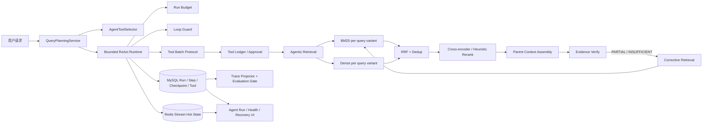

# 2026-07-22 至 2026-07-27 二次开发功能说明

## 1. 分析范围与结论

分析范围为当前分支 `main` 上 2026 年 7 月 22 日 00:00 至 7 月 27 日当前 HEAD `9c20d11` 的提交。该区间没有 7 月 22 日至 24 日的提交，实际开发提交集中在 7 月 25 日至 27 日。

对比区间前最近基线提交 `1c9e764`，本轮共有：

| 项目 | 数量 |
| --- | ---: |
| 提交 | 45 |
| Feature / Fix / Docs / Test / Chore | 27 / 6 / 10 / 1 / 1 |
| 改动文件 | 160 |
| 新增文件 | 106 |
| 新增 / 删除代码行 | 17,285 / 1,161 |
| 后端主代码 | 73 个文件，+7,811 / -308 |
| 后端测试 | 27 个文件，+2,098 |
| 前端 | 40 个文件，+3,905 / -450 |
| 文档 | 19 个文件，+3,469 / -403 |

这轮开发的核心不是单一页面或单一接口，而是把开源项目已有的 RAG/聊天能力向三个方向深化：

1. 检索从“单查询混合搜索”升级为可规划、可追踪、可纠正的 Agentic Retrieval。
2. Agent 从“手写 ReAct 循环”升级为受预算、状态、工具协议和审计约束的领域化 Runtime。
3. 质量保障从“主观查看回答”升级为基于真实运行事实的检索/轨迹评测和可视化运行观测。

## 2. 总体架构



核心边界是：LLM 负责生成意图、查询变体和工具候选；后端确定性逻辑负责权限、预算、状态迁移、工具副作用、回放和评测。

## 3. 功能一：统一查询规划与工具路由

### 3.1 解决的问题

原先工具可以在各自内部再次理解和改写查询，容易出现：

- 同一次请求多次调用规划模型，增加延迟和 Token 成本；
- ChatHandler、工具选择和检索各自得到不同意图，控制状态分叉；
- 模型仅靠 Prompt 决定工具可见性，后端缺少强约束。

### 3.2 实现方式

`QueryPlanningService` 在请求入口生成一次 `QueryPlan`，包含：

- intent：CHAT、KNOWLEDGE_QA、SUMMARY、COMPARE、MULTI_HOP、ACTION；
- complexity：SIMPLE 或 COMPLEX；
- retrievalRequired、clarificationRequired；
- entities、constraints、knownSlots、missingSlots；
- clarificationQuestion 和候选项；
- ORIGINAL、LEXICAL、SEMANTIC、DECOMPOSED 查询变体；
- planner 来源和 confidence。

规划器优先调用结构化 LLM，要求只返回 JSON；解析失败、模型失败或关闭 LLM Planner 时，使用规则规划器降级。规则规划器能识别摘要、对比、执行和多跳意图，抽取中英文实体，并按连接词拆解复杂问题。

`AgentToolSelector` 再根据这份计划裁剪工具集合。`search_knowledge` 和 `generate_summary` 执行时接收同一 `QueryPlan`，不再重新规划。

### 3.3 工程价值

- QueryPlan 成为一次 Run 的控制平面和单一事实来源；
- 模型只能从后端允许的工具集合中选择；
- 规划、检索 Trace、运行 UI 和评测可以引用同一份 intent/variant 数据；
- Planner 失败不会使主链完全不可用。

## 4. 功能二：Multi-query + BM25/Dense + RRF 检索

### 4.1 检索流程

`AgenticRetrievalService` 对每个查询变体同时创建 BM25 和 VECTOR 任务，并在 `ragRetrievalExecutor` 有界线程池中并行执行。

```text
QueryPlan.variants
  -> 每个 variant 执行 BM25
  -> 每个 variant 执行 Dense KNN
  -> 汇总为多个 RankedList
  -> RRF 融合并去重
  -> Rerank
  -> Parent Context Assembly
  -> Evidence Verify
```

两个检索通道都在 Elasticsearch 查询内部执行相同的权限条件：

- 当前用户自己的文档；
- public 文档；
- 用户有效组织标签范围内的文档。

这比“融合后过滤”安全，因为越权候选不会进入排名、Trace 或模型上下文。

### 4.2 为什么使用 RRF

BM25 分数和向量相似度来自不同分布，直接做 `0.5 * bm25 + 0.5 * cosine` 需要额外归一化和标定。RRF 只使用名次：

```text
score(d) = sum(1 / (k + rank_i(d)))
```

当前默认 `k=60`。系统按 `fileMd5 + chunkId` 去重，并为每个候选保留：

- 来自 BM25、VECTOR 还是两者；
- query variant 类型和原查询；
- 原通道 rank、rawScore 和 RRF contribution；
- 最终 RRF 分数和 finalRank。

因此前端可以解释“这个片段为什么被召回”，评测也可以做通道消融。

### 4.3 重排与降级

`RerankerService` 支持三种路径：

1. 配置 HTTP endpoint 时调用 OpenAI-like Cross-encoder 服务；
2. 远程重排失败或超时时，回退到本地词项覆盖 + RRF 的启发式重排；
3. 关闭 reranker 时直接保留 RRF 排名。

重排只处理融合后的有限候选，不参与全库召回，避免 Cross-encoder 成本随文档量增长。

### 4.4 父子块上下文

`ParentContextAssembler` 让 child chunk 负责精确召回，命中后再查询 `DocumentParentChunk` 扩展为较完整的 parent context。相同 parent 下多个 child 只保留最高排名结果，减少上下文重复。

这解决了单一 chunk size 的矛盾：块太小缺上下文，块太大又降低检索精度。

## 5. 功能三：证据判断与纠正检索

### 5.1 证据状态

`EvidenceVerifierService` 以确定性规则输出四种状态：

- SUFFICIENT：结果数、原查询覆盖和复杂问题主题覆盖达到阈值；
- PARTIAL：已有部分覆盖但仍缺少主题；
- INSUFFICIENT：没有结果或几乎没有覆盖；
- CONFLICTED：保守规则检测到相反证据。

判断依据包括：

- 最小结果数；
- 查询词项/中文 bigram 覆盖；
- DECOMPOSED 主题或实体覆盖；
- 对“是否支持”类问题的保守冲突检测；
- 当前纠正轮次。

### 5.2 纠正循环

当状态为 PARTIAL 或 INSUFFICIENT 时，`CorrectiveQueryRefiner` 根据缺失主题生成新的 DECOMPOSED/LEXICAL/SEMANTIC 查询，再执行一轮双路召回、RRF、重排和证据判断。

循环具有三个停止条件：

1. 证据已充分或存在冲突；
2. 达到最大纠正轮次，当前默认 2；
3. 新一轮证据集合和覆盖主题的 `progressSignature` 与上一轮相同，判定无进展。

因此它不是让模型无限“再搜一次”，而是后端可配置、可观测、可终止的闭环。

### 5.3 当前边界

证据判断目前是词项覆盖和有限冲突规则，不等价于自然语言推理或 claim-level entailment。它适合控制是否补检索、部分回答或放弃，不应宣称已经彻底解决幻觉。

## 6. 功能四：有状态澄清和任务进度账本

### 6.1 有状态澄清

当 QueryPlan 表示关键槽位缺失时，系统不直接进入 ReAct：

1. `AgentPendingTaskService` 持久化原始问题、已知槽位、缺失槽位、澄清问题和 resumeNode；
2. Run 状态切换为 `WAITING_CLARIFICATION` 并写 checkpoint；
3. 用户下一条短回复会被识别为补充信息，与原始问题合并；
4. 原 Run 标记为 `RESUMED`，新 generation 创建新的 attempt；
5. 新 attempt 从约定节点继续规划和执行。

这样“北京”之类的短回答不会被当作全新的独立问题。

### 6.2 任务账本

对复杂、比较或多跳任务，`AgentTaskLedgerService` 创建目标、验收条件、todo、状态和 evidenceIds。每次工具返回后更新完成项、阻塞项和下一步，并把账本写入 checkpoint。

失败后创建新 attempt 时，系统恢复已完成项，减少重复检索和重复副作用。运行期的工作副本在内存中维护，持久化事实位于 checkpoint。

## 7. 功能五：有界 Agent Runtime

### 7.1 四类硬预算

`AgentRunBudgetController` 使用单调时钟记录一次 generation 的使用量，并在模型轮次和工具调用前检查：

- 最大模型轮次，默认 4；
- 最大工具调用数，默认 8；
- 最大 Prompt/Completion Token，默认 24,000/8,000；
- 最大墙钟时间，默认 120 秒。

超过预算后不抛出不可解释的通用错误，而是写入明确 `AgentTerminalReason`，并要求模型基于已有信息生成确定性的部分回答。

### 7.2 语义循环守卫

`AgentLoopGuard` 对规范化的工具名和参数生成动作指纹，对工具观察生成内容签名：

- 同一动作重复达到 warning threshold 时产生告警；
- 达到 hard limit 时终止；
- 连续观察没有进展达到阈值时以 NO_PROGRESS 收敛。

这补足了“只限制固定轮数”无法识别语义重复的问题。

### 7.3 多工具协议闭合

OpenAI-compatible 模型一次 assistant message 可能返回多个 `tool_calls`。如果第一个调用已经触发终止或直接流式输出，简单中断会导致后续 call id 没有对应 ToolMessage，下一轮模型请求协议不完整。

`AgentToolBatchExecutor` 保证每个 call id 都得到结果：正常执行的返回实际 ToolMessage，未执行的返回结构化 `CANCELLED_BY_RUNTIME`。因此消息序列始终满足“一次 tool call 对应一个 tool result”。

### 7.4 类型化终止原因

运行时使用 `AgentTerminalReason` 区分正常回答、用户取消、等待澄清、等待审批、证据不足、冲突、轮次/工具/Token/时间预算耗尽、循环或无进展、可重试失败和致命失败。前端和评测不需要解析自由文本错误。

## 8. 功能六：工具治理、隔离和安全回放

### 8.1 工具策略

每个工具声明四类策略：

| 工具 | 风险 | 作用 | 并发 | 回放 |
| --- | --- | --- | --- | --- |
| search_knowledge | READ_ONLY | READ | PARALLEL_SAFE | REPLAY_SAFE |
| generate_summary | GENERATIVE | GENERATE | SERIAL_PER_RUN | REPLAY_SAFE |
| submit_feedback | WRITE_USER_SCOPE | WRITE | SERIAL_PER_USER | AT_MOST_ONCE |
| knowledge_stats | READ_ONLY | READ | PARALLEL_SAFE | REPLAY_SAFE |

当前批次执行器按顺序闭合工具调用，`ConcurrencyPolicy` 已进入工具契约，但尚未按 PARALLEL_SAFE/SERIAL_PER_RUN/SERIAL_PER_USER 分别调度；简历中适合表述为“声明并预留并发策略”，不应表述为已经完成策略化并行调度。

### 8.2 执行隔离

`AgentToolExecutionGuard` 提供：

- 独立工具线程池；
- 用户级 Semaphore 并发上限；
- 工具调用超时和 Future 取消；
- 按工具统计连续失败的进程内熔断器；
- 强制 userId 和风险等级校验。

`AgentToolErrorClassifier` 将异常映射为 INVALID_ARGUMENT、PERMISSION_DENIED、NOT_FOUND、RATE_LIMITED、TIMEOUT、INTERNAL 等稳定类型，并给出是否可重试和建议动作。

### 8.3 Tool Ledger 与回放

工具执行前，`AgentToolLedgerService` 先持久化：

- generationId、toolCallId、toolName；
- 规范化 actionFingerprint 和 idempotencyKey；
- 参数、风险、作用、回放策略；
- RUNNING/SUCCESS/FAILED/UNKNOWN/WAITING_APPROVAL/REUSED 等状态。

数据库以 `(generation_id, action_fingerprint)` 建唯一约束，同时 idempotencyKey 全局唯一。

恢复时：

- REPLAY_SAFE 且已成功的调用直接复用持久化结果；
- AT_MOST_ONCE 写工具若状态未知则停止，不盲目重试；
- REQUIRES_APPROVAL 工具进入人工审批；
- 用户拒绝后回放安全拒绝结果，让模型提供替代方案。

### 8.4 审批恢复

审批接口验证 Run 所属用户、当前状态和 Tool Ledger 归属。批准或拒绝是幂等决定，完成后通过新的 generation 创建新 attempt，保留原动作指纹和 source ledger 关系。

## 9. 功能七：持久化运行、检查点与恢复

### 9.1 MySQL 事实模型

- `agent_runs`：问题、用户、会话、状态、当前阶段、答案、错误、Token、终止原因和 retry 谱系；
- `agent_steps`：阶段、标题、工具、状态、结构化 metadata 和发生时间；
- `agent_checkpoints`：Run 开始、步骤终态、澄清、审批、任务账本和 Runtime Snapshot；
- `agent_tool_calls`：动作指纹、参数、风险、回放策略、结果和复用来源；
- `agent_pending_tasks`：等待澄清的任务；
- `agent_memories`：带治理状态的用户长期记忆。

### 9.2 Redis 职责

Redis 只承担活动 generation 的流式文本、事件和短期断线续传，不作为长期审计事实源。对话最终先事务性落 MySQL，成功后才更新 Redis 短期历史，避免两边不一致。

### 9.3 版本化 Runtime Snapshot

`AgentRuntimeStateService` 使用 append-only checkpoint 保存：

- schemaVersion；
- 单调增长的 stateVersion；
- status、currentNode、terminalReason；
- budgetUsage 和 taskLedger；
- updatedAt。

读取时校验 schemaVersion 和 generationId。COMPLETED/FAILED/CANCELLED/INTERRUPTED/RESUMED 等终态不能迁回 RUNNING。

### 9.4 服务重启语义

服务启动后，旧进程中的流式连接和 Future 无法真正恢复，因此系统把悬空 RUNNING 任务标记为 `INTERRUPTED`，保留 checkpoint 并允许用户创建新 attempt。

这是“可恢复执行”，但不是任意节点透明续跑。简历和面试应准确描述为“中断识别 + checkpoint 重试谱系”。

## 10. 功能八：模型故障转移、上下文预算与错误安全

### 10.1 多模型故障转移

`LlmProviderRouter` 获取按优先级排列的候选供应商，遇到 401、403、408、429、5xx 或网络错误时切换备用模型。流式请求只有在尚未向用户输出内容时才 failover，避免两个模型的文本拼接。

调用前统一预留 Token 配额：成功后按实际 usage 结算，所有供应商失败则撤销预留，避免失败请求错误扣费。

### 10.2 上下文压缩

`AgentContextBudgetService`：

- 始终保留 system message；
- 按消息组从新到旧裁剪；
- 将 assistant `tool_calls` 与对应 ToolMessage 作为一个原子组，避免拆散协议；
- 限制历史消息字符和工具 observation 长度；
- 返回原始/压缩字符数和丢弃消息数供日志观测。

### 10.3 安全改动

- 登录“记住我”只保存用户名，并清理历史 localStorage 中的明文密码；
- Web/Security 日志默认从 DEBUG 降到 INFO，降低登录 DTO 和 WebSocket token 泄露风险；
- `AgentErrorSanitizer` 将认证、限流、超时和网络错误转换为稳定语义，并脱敏 URL、Bearer Token 和 API Key；
- 本地模型密钥配置通过 `application-local.yml` 隔离并加入 `.gitignore`。

需要继续改进的一点是：`LlmProviderRouter.logProviderError` 当前对 `WebClientResponseException` 仍会记录完整响应体，后续应再做长度限制和敏感字段过滤。

## 11. 功能九：治理型记忆

`AgentMemoryService` 没有把全部聊天历史直接拼入长期 Prompt，而是为记忆保存 owner、scope、type、key、来源、置信度、状态、过期时间和访问次数。

- 点赞可形成 ACTIVE preference；
- 只有明确纠错内容才直接形成 ACTIVE correction；
- 仅点踩而没有纠错内容时进入 PROPOSED，防止把弱信号当成事实；
- 用户可把记忆转换为 ACTIVE、REJECTED 或 EXPIRED；
- 查询时用轻量词项/中文 bigram 相似度筛选相关记忆；
- 记忆只能调整回答，不覆盖系统规则和知识库事实。

## 12. 功能十：检索与 Agent 真实轨迹评测

### 12.1 检索评测

`RetrievalEvaluationService` 对每条黄金用例实际执行检索，计算：

- Recall@K；
- MRR；
- nDCG@K；
- Zero Recall Rate；
- P95 Latency。

再与 `application.yml` 中的阈值比较，输出逐项 Gate 和总通过状态。

### 12.2 Agent 评测

`AgentTraceProjector` 从 MySQL 的 Run、Step 和 Tool Ledger 投影事实，不接受客户端提交 actual/passed。`AgentEvaluationRunner` 按数据集中的 generationId 读取真实样本，并计算：

- 澄清 Precision/Recall/F1 与槽位 F1；
- intent/evidence status macro-F1；
- 冲突检测 F1；
- 轨迹 LCS/F1 和非法迁移率；
- 工具选择 F1 和参数指纹准确率；
- 引用 F1、claim coverage；
- 重复动作率、终止原因准确率；
- 恢复成功率、重复副作用率；
- pass@1 和 pass^k；
- P95 与 Token 总成本。

### 12.3 评测边界

当前仓库提供了样例黄金集和指标代码，但没有足够的真实消融结果可以支持“效果提升 X%”的简历数字。另一个已知限制是 `AgentTraceProjector` 的 supportedClaimIds 仍为空，claim coverage 需要补充引用到 claim 的服务端投影逻辑。

## 13. 功能十一：运行观测与桌面 UI

7 月 27 日的前端改动围绕“知识智能控制台”重塑了桌面体验：

- 导航按核心工作台、Agent 治理、组织与系统、账户服务分组；
- 聊天页新增 `AGENT RUN` 面板，展示 Query → BM25+Vector → RRF → Rerank → Evidence；
- 展示 intent、可见工具数、模型轮次、工具调用、Token、耗时、traceId 和 evidence status；
- 展开步骤可以查看每个检索阶段的输入/输出数、耗时和降级原因；
- 对 WAITING_APPROVAL 展示高风险审批卡片；
- 对失败/中断任务提供 checkpoint 重试入口；
- 会话侧栏展示 30 天成功率、P95、Token、失败阶段和恢复成功率；
- 模型配置页增加供应商展示和 JD Cloud 识别；
- 知识库页面强化上传和使用引导；
- 登录页统一知枢品牌并移除明文密码记忆。

这部分不是简历后端主线，但能证明新后端状态、Trace 和审批协议已经形成端到端产品闭环。

## 14. 新增主要接口

| Method | Path | 作用 |
| --- | --- | --- |
| GET | `/api/v1/chat/agent-runs/{generationId}` | 查询 Run、Step 和最新 checkpoint |
| GET | `/api/v1/chat/agent-runs` | 查询某会话可恢复运行 |
| GET | `/api/v1/chat/agent-runs/metrics` | 查询运行健康指标 |
| POST | `/api/v1/chat/agent-runs/{generationId}/retry` | 从 checkpoint 创建新 attempt |
| POST | `/api/v1/chat/agent-runs/{generationId}/tool-approvals/{toolLedgerId}` | 审批并恢复工具运行 |
| GET | `/api/v1/chat/memories` | 查询当前用户长期记忆 |
| PUT | `/api/v1/chat/memories/{memoryId}/status` | 治理记忆状态 |
| POST | `/api/v1/chat/evaluations/retrieval` | 执行检索黄金集评测 |
| POST | `/api/v1/chat/evaluations/agent` | 执行真实 Agent 轨迹评测 |

## 15. 测试与验证证据

本轮新增 27 个后端测试文件，覆盖：

- Query Planner、Agentic Retrieval、RRF、纠正检索和证据判断；
- Runtime Budget、Loop Guard、Tool Batch、Tool Selector；
- Tool Guard、Error Classifier、Ledger、Approval；
- Run、Pending Task、Task Ledger、Runtime Snapshot；
- Memory、Retrieval Metrics、Agent Evaluation/Runner/Projector；
- 模型配置和敏感信息处理。

前端增加了导航分组、运行终态、登录凭据清理、模型展示和桌面 UI contract 等基线测试文件。

当前本机没有运行 PaiSmart 后端或 9527 前端，无法完成浏览器、Network、MySQL/Redis 的实时验证；本说明以 Git 历史、源码、测试源码和静态配置为依据。

本次核验实际执行了 Java 17 核心测试命令，但 Maven 首次解析依赖长时间停留在镜像下载；离线重试确认仍缺少 `jaxb-runtime-parent:4.0.5`，且 Maven 配置指向的 `WangYinNexus` 依赖尚未缓存，所以没有得到测试通过结果。前端基线测试也因 pnpm 镜像下载超时、`tsx` 未完成安装而没有进入测试执行。后续应在依赖可用后重新执行核心测试，再启动实际服务验证检索、恢复和评测接口。

## 16. 后续优先建议

1. 建立 100-300 条真实中文企业问答黄金集，补齐五组消融 profile 和可复现指标。
2. 为 claim coverage 增加回答 claim → citation → chunk 的服务端投影，不再依赖空占位。
3. 用真正的中文 reranker 校准当前本地启发式降级，避免连续中文文本被粗粒度分词影响。
4. 做进程崩溃、Redis 不可用、ES 部分通道失败、LLM 429、工具结果未知等故障注入。
5. 将进程内工具熔断状态迁移到可共享或可观测的组件，以支持多实例部署。
6. 为 Runtime Snapshot 设计 schema migration，而不只是拒绝未知 schemaVersion。
7. 收紧供应商异常日志，避免完整响应体带出敏感字段。
8. 补端到端浏览器测试，覆盖澄清、审批、断线、重试、引用预览和历史恢复。

## 17. 提交时间线

### 7 月 25 日：Agentic RAG 与 Runtime 基础闭环

- `d63c38b`：统一知枢品牌与 Logo。
- `3561461`：补充 Agentic RAG 架构和 PRD。
- `469860c`：重构 Agent 对话流程与执行轨迹 UI。
- `ae9e905`：实现 Multi-query、BM25/Dense 和 RRF 重排链路。
- `9692e0a`：增加 Run/Step/Checkpoint 审计账本。
- `d7e4d86`：增加治理型记忆和检索评测。
- `f0e57c9`：增加工具隔离、熔断与中断恢复。
- `3b90acf`：增加上下文预算与工具观察压缩。
- `91f86ea`：增加 LLM 故障转移和失败配额回滚。
- `64df654`：增加错误脱敏与安全审计语义。
- `ff7fa4c`：增加 checkpoint 重试与跨刷新恢复。
- `6eb7470`：避免登录凭据和 WebSocket token 进入常规日志。
- `cd99869`：增加运行指标和健康度面板。
- `fa97b08`：完善 README 和面试讲解。
- `45f6dec`：补充 Agent 运行时闭环 PRD/架构。
- `6d4c642`：增加证据判断与纠正检索。
- `6103d1f`：增加有状态澄清与任务恢复。
- `3858695`：增加语义循环守卫与终止原因。
- `d3da60d`：增加可恢复任务进度账本。
- `1ea54af`：增加工具安全回放和审批恢复。
- `be69e2b`：增加 Agent 轨迹评测和质量门禁。

### 7 月 26 日：统一 Runtime Kernel

- `b82df52`：完善 Runtime Kernel PRD/架构。
- `c018c2b`：统一 QueryPlan 与工具路由。
- `c7f5dec`：闭合多工具调用协议。
- `2e932ab`：增加硬预算和类型化错误。
- `c3b742d`：打通高风险工具审批与恢复。
- `9c48d39`：增加版本化 Runtime Snapshot。
- `1df4bd7`：建立真实轨迹评测 Runner。
- `55574e9`：增加前端 Runtime Control Center。
- `8d7e7c1`：修复运行组件依赖注入。
- `3c9018c`：回写实现状态和面试说明。
- `d67dab4`、`95c23d9`：记录 JD Cloud 本地模型接入方案与计划，属于文档设计，不能当作已完成接入。
- `b64e9a5`：隔离本地模型密钥配置。
- `9f822da`：补充桌面 UI 改造方案。

### 7 月 27 日：桌面控制台和体验收口

- `3e1c538`：重塑导航与主题层级。
- `551528e`：优化 Agent 对话与运行观测层级。
- `f122b5f`：完善模型配置和知识库引导。
- `11da9d8`：固化导航路由元数据。
- `226c362`：重构登录品牌体验并移除明文密码记忆。
- `8c95c59`：完善桌面 UI 验证基线。
- `598a4b0`：清理方案文档格式。
- `bd47148`：补充界面精修方案。
- `ef69015`：精修聊天布局与回答样式。
- `9c20d11`：修正桌面应用壳层安全区。
