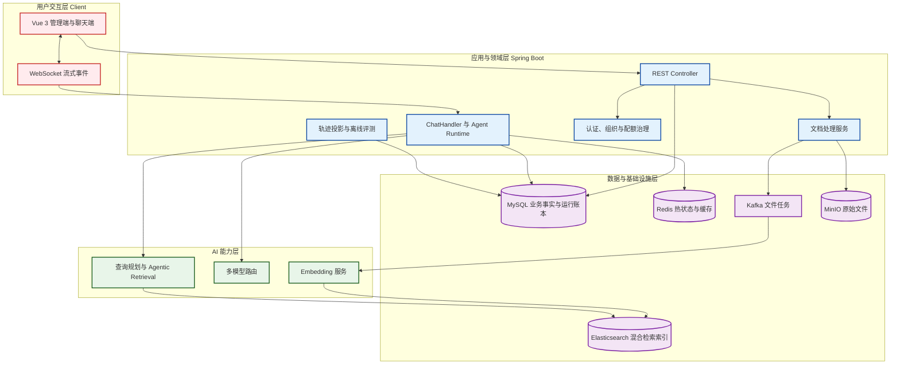
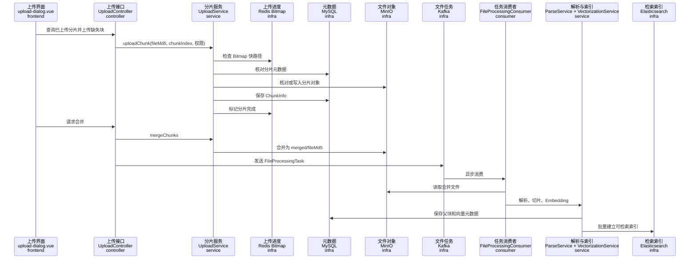
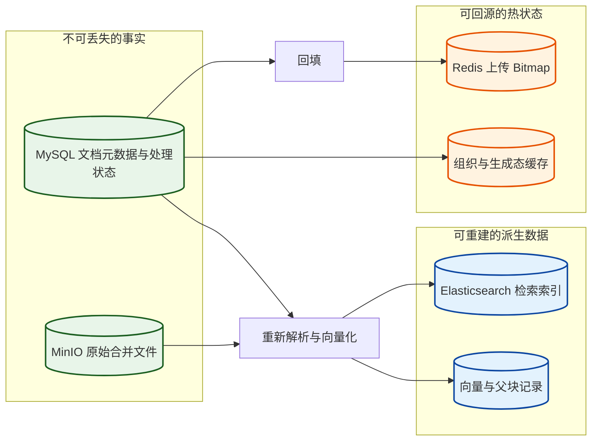
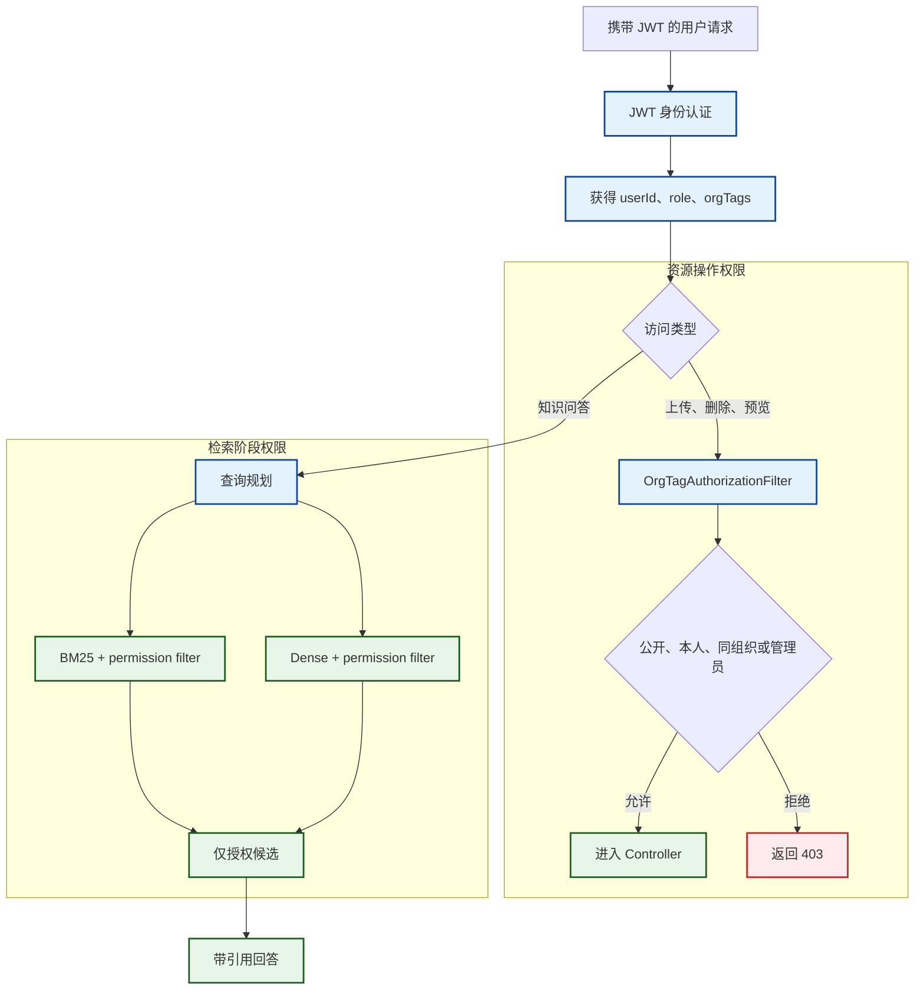
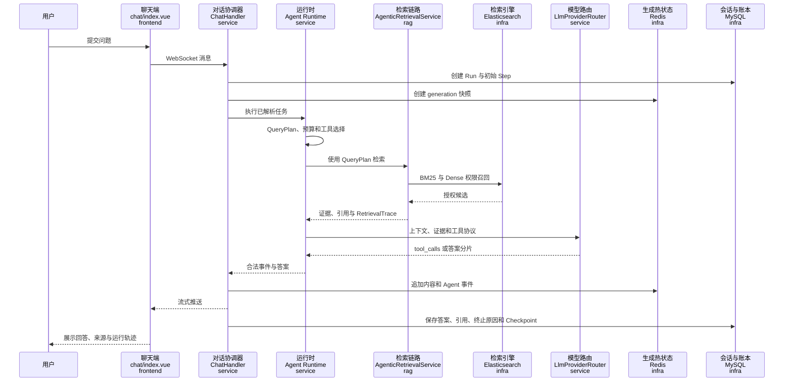
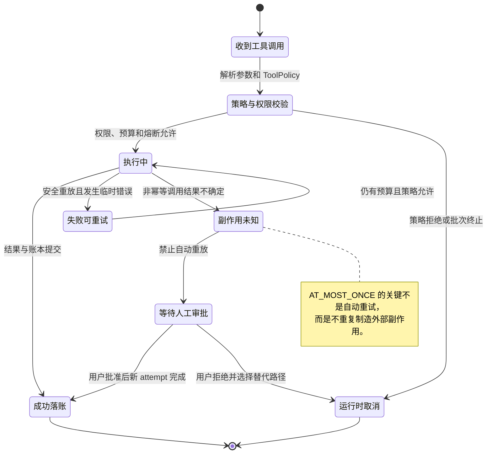
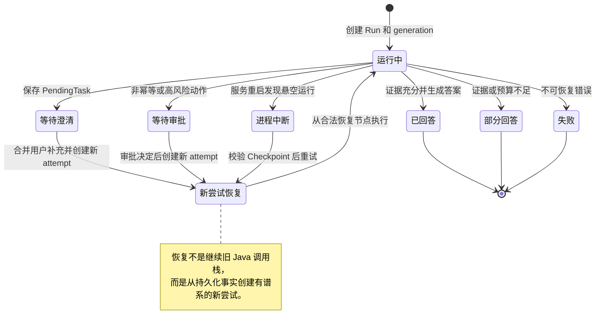
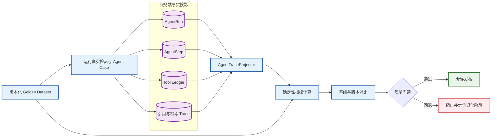

# 知枢项目模拟面试：20 个全项目视角的深度问题与参考答案

## 使用说明

这份文档仍然是一份模拟面试题库，而不是项目功能说明书。每道题都按照真实面试中的口述方式编写：先回答面试官当前问到的问题，再把它放回知枢的整体业务与架构中，说明相关模块为什么存在、数据怎样流动、异常怎样处理，以及方案背后的工程取舍。

回答时不需要逐字背诵。建议先记住每题的主线，再根据面试官追问展开实现细节。涉及性能和效果时，只讲系统已经具备的评测方法，不虚构没有实测过的 QPS、召回率或准确率数据。

---

## 1. 请你介绍一下知枢项目。它解决什么问题，整体架构是怎样的？

### 参考回答

知枢是一套面向企业内部知识场景的可解释 Agentic RAG 系统。我在设计这个项目时，首先解决的不是“怎么调用一次大模型”，而是企业已经积累了大量 PDF、Word、Markdown 等非结构化文档，却很难被员工快速、准确并且符合权限地使用。传统文档管理只能按照目录或标题查找，普通大模型又不知道企业私有知识，因此系统需要同时解决知识摄入、权限检索、可信生成、运行治理和结果追溯五类问题。

从用户视角看，知枢有两条核心业务链路。第一条是知识生产链路：用户上传文件，系统完成分片上传、对象存储、异步解析、文本切分、向量化和 Elasticsearch 建索引。第二条是知识消费链路：用户在聊天界面提出问题，系统识别意图、规划查询、执行 BM25 与 Dense 混合召回、融合重排、补充父上下文、验证证据，再让大模型基于证据生成带引用的回答。围绕这两条主链，我又补充了用户与组织管理、对话历史、模型配置、Token 配额、运行恢复、长期记忆和离线评测。

架构上我采用前后端分离。前端使用 Vue 3、TypeScript、Pinia、Naive UI 和 Vite，负责知识库管理、流式聊天、历史会话、Agent 运行轨迹和管理控制台。后端使用 Spring Boot 3.4 与 Java 17，对外提供 REST 和 WebSocket 能力。MySQL 保存用户、文档元数据、会话、Agent Run/Step/Checkpoint 等长期事实；Redis 保存上传 Bitmap、缓存和短期生成态；MinIO 保存原始文件；Kafka 解耦耗时的解析向量化任务；Elasticsearch 同时承担关键词与向量检索；外部 LLM 和 Embedding 服务负责生成与语义表示。

整体结构不是简单地把中间件堆在一起，而是按照数据职责划分。原始二进制文件进入 MinIO，强一致的业务事实进入 MySQL，高频短生命周期状态进入 Redis，可搜索的派生索引进入 Elasticsearch，耗时任务通过 Kafka 异步化。这样任何一个派生层出现问题，都能从更权威的数据源重建，而不是把 Redis 或 ES 错误地当成唯一事实来源。



如果让我用一句话概括项目的技术价值，我会说：它把“能回答问题的 RAG Demo”建设成了“权限正确、过程可见、失败可恢复、结果可评测的企业知识系统”。这也是我讲这个项目时最希望体现的地方——我关注的不只是某个算法，而是从知识进入系统到答案被用户消费的完整闭环。

### 面试官可能继续追问

- 为什么不是直接使用现成的向量数据库？
- MySQL、Redis、Elasticsearch 分别出现故障时，系统还能保留什么？
- 你认为这个架构中最核心的领域边界是什么？

---

## 2. 如果这个项目由你从 0 到 1设计，你是怎么拆解需求和确定第一版边界的？

### 参考回答

我会先把需求拆成“必须形成闭环的主链”和“可以后续增强的治理能力”。第一版必须完成的是：用户能够登录，上传一份有权限属性的文档，系统能够稳定完成解析和索引，用户能够基于自己有权访问的内容提问，并且得到可追溯到原文的回答。如果这条闭环没有成立，即使加入再多 Agent、记忆或评测概念，项目也只是功能集合。

确定主链后，我会再按照数据生命周期拆分领域。用户与组织域负责“谁能做什么”；文档域负责“知识怎样进入系统”；检索域负责“怎样找到正确证据”；对话域负责“问题、回答和引用怎样持久化”；Agent 运行域负责“复杂任务如何在预算内执行和恢复”；模型与用量域负责“外部模型怎样路由、计费和降级”。这种拆法比按 Controller、Service、Repository 技术分层更重要，因为技术分层只能告诉我代码放在哪里，领域拆分才能告诉我一个状态由谁负责。

我还会提前定义几个不可妥协的不变量。第一，权限必须在召回阶段执行，不能检索后再靠前端隐藏；第二，MySQL 是持久化事实来源，Redis 只能做热状态；第三，任何会产生副作用的工具都不能盲目自动重放；第四，模型不能决定权限、预算和状态迁移，这些必须由 Java 运行时控制；第五，回答中的引用必须随着会话一起持久化，否则历史回答会失去证据链。

第一版我不会直接上复杂的多 Agent 编排，也不会为了“技术先进”引入向量数据库、工作流引擎和分布式事务框架。单 Agent 加清晰状态机已经能覆盖查询规划、检索、工具调用和回答生成。只有当评测证明单 Agent 的职责冲突成为瓶颈，我才会进一步拆成 Planner、Retriever、Verifier 等多个自治 Agent。这个选择体现的是 YAGNI：先保证闭环正确，再根据数据演进。

从交付顺序看，我会先建立用户、权限和文档上传；再完成解析、切片、向量化与检索；之后接入流式对话和引用持久化；最后增强 Agent Runtime、恢复、评测和长期记忆。这样每个阶段都能形成可验证的产品增量，而不是等所有基础设施都搭完才看到第一次回答。

这里的“从 0 到 1”不只是把代码写出来，更重要的是先定义系统边界和正确性标准。比如“上传成功”不能只等于 HTTP 返回 200，而要区分分片上传完成、文件合并完成、解析完成和向量索引完成；“回答成功”也不能只等于模型输出了文字，而要区分是否找到证据、是否有权访问、运行是否完整落账、引用是否能打开。把这些语义定义清楚，后面的实现才不会混乱。

### 回答时应强调的判断

我会强调自己做的是一套端到端知识系统，因此每次引入组件都必须回答两个问题：它解决了哪个明确的业务矛盾，以及它失败以后系统如何恢复。如果回答不出来，这个组件就不应该进入第一版。

---

## 3. 为什么选择 Spring Boot、MySQL、Redis、Elasticsearch、Kafka 和 MinIO？是不是技术栈太重了？

### 参考回答

我没有按照“企业项目必须组件齐全”的思路选型，而是从数据类型、访问模式和故障边界反推技术。知枢同时处理关系型业务数据、短期高频状态、全文与向量检索、二进制大文件和耗时异步任务，单一数据库很难同时把这些工作做好，因此需要分工。但我也尽量让每个组件只有一个主要职责，避免同一事实同时存在多个权威版本。

Spring Boot 适合作为主应用框架，是因为项目的核心治理能力——Spring Security、JWT 过滤链、JPA 事务、Kafka 消费、Redis、WebClient 和配置管理——都可以在一个成熟生态中完成。Java 17 对强类型领域模型也很合适，例如 Agent 的状态、终止原因、工具风险和预算决策都可以显式建模，减少用 Map 或字符串传递状态造成的歧义。

MySQL 保存必须长期存在、需要事务和审计的数据，例如用户、组织关系、文件元数据、会话消息、Token 使用记录，以及 AgentRun、AgentStep、Checkpoint、ToolCall。系统重启后，我首先相信的是 MySQL 中已经提交的事实。Redis 保存上传进度 Bitmap、组织标签缓存、限流计数和 30 分钟内的流式生成快照，这些数据强调低延迟和 TTL，即使丢失也能从 MySQL 或业务流程恢复。

Elasticsearch 不是事实库，而是检索投影。它同时支持 BM25 关键词匹配和向量相似度搜索，而且文档索引中可以携带 `userId`、`orgTag`、`public`、页码、锚点和父块标识，便于在检索阶段完成权限过滤和证据定位。如果 ES 索引损坏，可以根据 MinIO 原文件与 MySQL 中的文档元数据重新解析、向量化和建索引。

MinIO 解决大文件对象存储，不让数据库承担二进制文件和分片合并压力。Kafka 把用户请求与解析、OCR、Embedding 等慢任务解耦：合并完成后快速返回“已进入处理”，消费者再异步执行。这样大文件处理不会长时间占用 HTTP 线程，也能利用消费者错误处理实现重试和死信语义。

这套技术栈确实比单体 CRUD 重，但复杂性来自业务本身，而不是为了展示技术。真正需要控制的是跨存储一致性：MySQL、MinIO、ES 和 Kafka 无法共享一个本地事务，所以我采用状态机、幂等键、可重试任务和重建能力，而不是假设它们能够强一致提交。后续如果业务规模很小，可以把 Kafka 替换为数据库任务表，把 MinIO 替换为本地对象存储接口实现；领域边界不变，基础设施可以收缩。

### 深层取舍

我不会说“使用中间件就一定高性能”。Redis、Kafka、ES 都会增加部署和运维成本。它们成立的前提是：Redis 中的数据可丢失，Kafka 消息可重复消费，ES 索引可重建，MinIO 对象能通过业务元数据定位。只有这些前提明确，系统才不会因为引入组件而产生更难处理的数据不一致。

---

## 4. 一份几百 MB 的 PDF 从用户点击上传到最终可以被检索，完整链路是怎样的？

### 参考回答

我把文件摄入设计成两个阶段：前台可恢复上传和后台异步知识加工。这样既解决大文件网络不稳定，也避免解析和向量化阻塞用户请求。前端先计算文件 MD5 并切分分片，上传前查询已经完成的分片，只发送缺失部分。后端以 `userId + fileMd5` 组织 Redis Bitmap，快速表示哪些分片已上传，同时用 MySQL `FileUpload` 与 `ChunkInfo` 保存持久元数据，用 MinIO 保存真实分片对象。

上传分片时不能只看 Redis 某一位是否为 1。Redis 可能重启或写入成功后对象上传失败，所以 `UploadService` 会交叉检查 Bitmap、数据库分片记录和 MinIO 对象。三者一致时才按幂等成功处理；状态不一致时清理陈旧记录，或者从数据库回填 Redis。这体现了系统整体的数据层次：Redis 是进度快路径，MySQL 加 MinIO 才能证明分片确实可用于合并。

所有分片齐全后，后端把文件状态从上传中迁移到合并中，在 MinIO 生成 `merged/{fileMd5}` 对象，完成后更新合并状态。随后构造 `FileProcessingTask`，把文件 MD5、对象路径、上传者、组织标签、公开属性和任务类型一起发送到 Kafka。权限属性必须在这个阶段随任务传递，不能等建立索引时再临时查询，否则异步执行期间元数据变化容易产生错误索引。

消费者收到任务后从 MinIO 读取合并文件。PDF 可以走 LiteParse/OCR 链路，其他文档可以由 Apache Tika 自动识别并提取文本。解析服务生成父块与检索子块，保留页码、锚点和父块关系；向量化服务批量调用 Embedding 模型，保存可重建的向量元数据，并批量写入 Elasticsearch。索引文档同时包含文本、向量、文件 MD5、用户、组织和公开属性，因此上线检索时不需要再回表拼接权限。



失败语义也要分阶段。某个分片失败，客户端只重传该分片；合并失败，文件不能进入已完成状态；Kafka 生产失败，接口不能假装任务已经提交；解析或向量化失败，`vectorizationStatus` 记录失败原因，用户可以发起重新索引。重新索引会先清理旧的 ES 和向量派生数据，再从 MinIO 原文件重建。这样“文件存在”和“知识可检索”是两个明确状态，前端也能给用户正确反馈。

### 面试官可能继续追问

- Redis Bitmap 丢失后为什么仍能断点续传？
- Kafka 重复投递会不会重复建立索引？
- 文件合并成功但消息发送失败如何补偿？

---

## 5. 文档解析、切片和向量化是怎么设计的？为什么要做父子分块？

### 参考回答

这部分不能孤立地看成“把文本每 500 字切一次”，因为切片策略会同时影响召回、重排、生成上下文和引用预览。我设计时把目标拆成两个相互冲突的需求：检索希望块尽量小，让关键词和语义更聚焦；生成希望上下文足够完整，避免模型只看到一句结论却看不到条件和例外。父子分块就是为了解耦这两个粒度。

解析阶段首先负责把不同文件格式归一化为带结构信息的文本。普通 Office 或文本文件通过 Apache Tika 提取；PDF 根据配置走 LiteParse，并支持 OCR 场景。除了正文，我还保留页码和 anchorText，因为回答中的引用最终要回到文档预览。如果解析时丢掉定位信息，检索即使找对内容，用户也无法验证来源。

之后生成较大的父块和较小的子块。子块用于 Embedding、BM25 和 Dense 召回，携带 `parentChunkId` 与 `parentChunkIndex`；父块保存在 `DocumentParentChunk` 中。命中多个属于同一父块的子块时，`ParentContextAssembler` 会去重并扩展为父级上下文。这样 ES 仍然使用精细粒度排序，而送入大模型的是语义更完整的内容。

向量化并不是只保存一个 float 数组。每个 `DocumentVector` 同时保存 fileMd5、chunkId、原始文本、contextualText、页码、锚点、父块关系、模型版本和权限字段。写入 Elasticsearch 的 `EsDocument` 也保留这些数据。这样后续如果切片算法或 Embedding 模型升级，我可以通过 modelVersion 和重建流程区分旧索引，而不是让不同版本向量混在一起。

Embedding 调用是外部成本和延迟的重要来源，因此会按块批量处理并记录实际 token 与块数量。文件元数据中区分 estimated 和 actual usage，既便于上传前给出成本预估，也便于处理后进行配额结算。这里把 AI 调用纳入业务计量，避免“向量化只是后台技术细节”导致成本失控。

父子分块也有代价：需要额外的父块表、关系字段和上下文装配步骤，而且父块过大会重新引入噪声。因此它不是越大越好。合理做法是通过离线数据集评估不同 child size、overlap、parent size 对 Recall@K、nDCG、答案引用完整度和 Token 成本的影响，再决定配置，而不是凭经验固定一个数字。

### 深层回答

如果面试官问“为什么不直接把 chunk 调大”，我会回答：大块提高了上下文完整性，却降低了检索判别力。同一个大块中可能同时包含多个主题，向量会变成多个语义的平均表达，BM25 也更容易被无关高频词干扰。父子分块让“找到哪里”和“给模型看多少”成为两个独立决策，是更可控的上下文工程方案。

---

## 6. MySQL、Redis、MinIO 和 Elasticsearch 之间的数据不一致，你是怎么处理的？

### 参考回答

我首先不会把这个问题包装成“已经实现分布式强一致”。这些组件没有共享事务，强行追求一次操作原子提交会显著提高复杂度。我的设计思路是先确定权威数据，再通过状态机、幂等和重建能力实现最终一致。不同链路的权威数据不同：用户与业务状态以 MySQL 为准，原始文件是否存在以 MinIO 为准，ES 是可重建索引，Redis 是可丢失热状态。

以上传为例，Redis Bitmap 只表示快速进度，不能单独证明分片成功。真正合并前要核对数据库 ChunkInfo 和 MinIO 对象；Redis 丢失时从数据库回填。以检索为例，ES 文档是从 MinIO 原文件和 MySQL 元数据加工得到的派生数据，所以索引失败不会删除原文件，而是把向量化状态记为失败并支持重新索引。

删除文档则是另一个典型跨资源操作。系统需要删除 ES 文档、MinIO 合并对象、MySQL 中的向量与父块数据、分片元数据和文件记录。这里即使方法放在数据库事务里，也不能回滚已经成功的 MinIO 或 ES 操作。因此更稳妥的生产方案不是假装本地事务覆盖了外部系统，而是引入删除状态和后台补偿：先把文档标记为 DELETING，使检索立即不可见，再异步清理各资源，全部成功后进入 DELETED；失败则记录具体资源并重试。

Kafka 侧要假设消息至少可能被投递一次以上。任务应使用 fileMd5、任务类型和版本形成业务幂等键，消费者执行前检查当前向量化状态和目标索引版本。写 ES 时使用稳定文档 ID，重复写覆盖同一记录；写 MySQL 时依赖唯一约束或先清理旧派生数据。当前项目已经具备重试、死信和重新索引能力，但如果部署到多实例生产环境，我还会补充 Outbox，解决数据库状态提交成功而 Kafka 消息发送失败的窗口。



判断数据一致性的关键不是“所有地方现在完全一样”，而是系统是否能回答：哪个状态可信、某一步重复执行是否安全、失败后从哪里恢复、用户当前能看到什么。如果这四个问题都有明确答案，最终一致才是可运营的；否则它只是把不一致推迟到线上暴露。

---

## 7. 这是企业知识库，多租户和文档权限是怎么保证的？怎样避免越权检索？

### 参考回答

我把权限看成贯穿全链路的数据属性，而不是 Controller 上的一个注解。文档上传时就必须确定 owner、orgTag 和 isPublic，这些字段随后进入 FileUpload、解析后的父子块、DocumentVector、Elasticsearch 文档以及 Kafka 任务。只有权限语义在知识加工过程中完整传递，检索时才能做真正的数据隔离。

请求入口使用 Spring Security 和 JWT 建立用户身份。`JwtAuthenticationFilter` 负责解析并校验 Token，把认证信息放入 SecurityContext；`OrgTagAuthorizationFilter` 对文档上传、删除、预览等资源操作解析 userId、role 和 orgTags，并根据公开、所有者、组织成员或管理员身份做判断。管理员接口继续使用角色约束，普通用户不能仅靠构造 URL 访问。

检索权限必须下推到 Elasticsearch 查询的 filter 中。BM25 和 Dense 是两条独立召回通道，所以两条都要应用相同的权限 bool 条件：文档属于本人，或者是公开文档，或者其组织标签在用户有效标签集合中。不能先在全库召回 topK 再在 Java 中过滤，因为未授权内容可能已经参与排序、进入日志或占满候选；即使最后没展示，也会造成召回质量下降和潜在侧信道泄漏。



组织标签本身也有缓存一致性问题。系统使用 `OrgTagCacheService` 获取有效标签，但成员关系变化后必须失效缓存，不能让旧权限一直有效。JWT 中携带的标签可以减少查询，但不能长期把它当成唯一真相，因为用户可能被移出组织。更严格的生产环境可以缩短 Token 生命周期、引入权限版本号或在高风险操作时回查数据库。

我还会把权限泄漏率设为硬门禁，而不是普通质量指标。检索离线评测不仅要测 Recall@K，也要加入“同一个问题由不同租户用户发起”的对照样例，确认返回文档 ID 完全符合授权集合。开放性回答可以接受评分波动，但越权候选必须为 0。

### 面试官可能继续追问

- 如果用户同时属于多个组织，ES 查询怎么构造？
- 用户被移出组织后，旧 JWT 和缓存如何处理？
- 为什么前端隐藏按钮不能算权限控制？

---

## 8. 用户在聊天框里提出一个问题后，到看到带引用的流式答案，中间完整发生了什么？

### 参考回答

一次问答会穿过身份、会话、Agent、检索、模型、持久化和前端恢复多个层次。前端先建立或复用 conversationId，通过 WebSocket 发送问题。后端验证用户与会话归属，为本次生成创建唯一 generationId；MySQL 中创建 AgentRun 作为长期运行事实，Redis 中创建带 TTL 的生成快照，用来保存正在流式输出的内容和 Agent 事件。

进入 Agent 主链后，系统先检查是否存在当前会话的 PendingTask。如果用户上一轮被要求补充城市，这一轮只输入“北京”，PendingTaskResolver 会把它合并到原任务，而不是当成独立问题。随后 `QueryPlanningService` 对已解析问题生成结构化 QueryPlan，包括意图、复杂度、实体、约束、缺失槽位、是否需要检索和查询变体。

运行时根据 QueryPlan 选择模型可见工具。需要企业知识时执行 `search_knowledge`，它复用已经生成的 QueryPlan 进入 AgenticRetrievalService，而不是在工具内部再次规划。每个查询变体分别进行 BM25 与 Dense 召回，所有通道都带权限过滤，然后通过 RRF 融合、重排、父上下文装配和 EvidenceVerifier 生成证据集合与 RetrievalTrace。

证据充分时，运行时把经过预算压缩的会话上下文、长期记忆摘要、QueryPlan、工具结果和引用规则组装给 LLM。模型响应可能是继续调用工具，也可能输出最终答案。Java 运行时负责校验工具名称、参数、风险、预算和循环状态；模型只负责语义决策，不能自行越过权限或重置预算。

模型输出通过 WebSocket 增量发送到前端，同时追加到 Redis 生成快照。完成后，问题、完整答案和 referenceMappings 写入 MySQL Conversation；AgentRun、Step、Checkpoint、Token 和终止原因也落库。历史页面重新加载时从 MySQL 读取问答与引用，而不是依赖 Redis。若浏览器中途刷新，前端先读取 active generation 和已累积事件，再继续展示流式结果。



这条链路的关键是把“用户看到的消息”“模型看到的上下文”和“系统审计事实”分开。用户界面只展示安全的运行事件和决策摘要，不暴露隐藏思维链；模型上下文可以因为 Token 预算被压缩和重建；MySQL 中的 Transcript 与运行账本则必须保留可以复盘的事实。

---

## 9. 为什么要从普通 RAG 升级为 Agentic RAG？所有问题都需要 Agent 吗？

### 参考回答

普通 RAG 通常是一条固定流水线：用户问题向量化、召回 topK、拼接 Prompt、调用模型。它对单一事实问答足够，但在知枢的完整业务中会遇到三个问题。第一，用户问题可能含糊，例如“北京的政策”，缺少主体和时间范围；第二，比较、多实体、多跳问题需要拆分查询，一次向量召回很难覆盖；第三，检索失败后固定流水线不会判断缺少什么，也无法决定澄清、改写还是部分回答。

Agentic RAG 的价值不是让模型无限自主，而是让系统可以在受控状态机中做有限决策。我让 Query Planner 识别意图、复杂度、实体、约束和槽位，生成 ORIGINAL、LEXICAL、SEMANTIC、DECOMPOSED 等查询变体；EvidenceVerifier 判断当前证据是充分、部分、冲突还是不足；CorrectiveQueryRefiner 只针对缺失方面生成差异化查询；Runtime 根据剩余预算决定继续检索、要求澄清、部分回答或拒答。

但是并非所有问题都需要完整 Agent 循环。闲聊或无需知识库的请求可以直接调用模型；明确的单事实问题可能只执行一次检索；只有复杂比较、多跳任务或证据不足时才创建 Task Ledger 并进入多轮工具执行。`AgentToolSelector` 也会根据 QueryPlan 控制模型可见工具，例如 summary 意图只暴露摘要工具，避免先搜索一次、摘要工具内部再重复搜索。

从整个项目看，Agentic RAG 依赖前面所有基础能力：没有可靠文档摄入就没有证据，没有租户过滤就不能安全检索，没有 Run/Step/Checkpoint 就无法恢复，没有 Token 配额就无法约束成本，没有前端运行面板就难以解释为什么系统正在重试。因此 Agent 不是项目外加的一层炫技，而是把检索、工具、状态和治理组织起来的执行内核。

我把自主权明确限制在语义层。模型可以建议下一步做什么，但 Java 代码决定这个工具是否存在、当前用户能否调用、参数是否合规、是否还有预算、是否出现循环、能否重放。这样才能在保留 Agent 灵活性的同时，把系统变成可预测的软件。

### 方案边界

Agentic 流程增加模型轮次、延迟和调试难度，所以必须通过路由让简单问题走短路径，并通过离线评测证明复杂问题的收益。如果评测只显示步骤更多，却没有提升召回和证据覆盖，那么这不是有效升级。

---

## 10. QueryPlan、多查询、BM25、向量召回和 RRF 是怎样配合的？

### 参考回答

我把检索设计成“规划一次、执行多路、统一融合”。QueryPlan 是一次 Run 的检索契约，包含 intent、complexity、entities、constraints、missingSlots、retrievalRequired 和 queryVariants。它由结构化 LLM Planner 生成，JSON 解析或模型调用失败时使用规则降级，保证检索主链不会因为 Planner 不可用而整体失败。

同一个 Run 中 QueryPlan 只生成一次，因为它不仅驱动检索，还驱动工具选择、Task Ledger、证据验证和 UI 展示。如果工具内部再次规划，可能出现外层判断 SUMMARY、内层判断 COMPARE 的状态分叉，也会增加模型成本。纠正检索只针对 missingAspects 生成新的查询，不重写原始计划，保证任务目标稳定。

多查询解决的是用户表达与知识库表达不一致。ORIGINAL 保留原始语义和所有约束；LEXICAL 强化实体、型号、制度名称等精确词；SEMANTIC 用自然语义扩展同义表达；DECOMPOSED 将比较或多跳问题拆成子问题。查询数量有配置上限，默认最多四个变体，并通过规范化 fingerprint 去重，避免变体爆炸。

每个查询变体都进入两个独立通道。BM25 擅长专有名词、编号和精确关键词；Dense 擅长同义表达和语义相近内容。Dense 查询不能再附加关键词 must，否则会在语义召回前错误截断候选。两个通道都携带完全一致的用户、组织和公开权限过滤。

不同召回分数不可直接线性相加，因为 BM25 与向量相似度不在同一标度，而且不同查询的分数分布也会变化。我使用 RRF 按名次融合：某候选在列表中的排名为 r，就贡献 `1 / (k + r)`，默认 rank constant 为 60。同一个 `fileMd5 + chunkId` 的候选先去重，再累加它在不同列表中的排名贡献。

```text
RRF(d) = Σ 1 / (k + rank_i(d))
```

RRF 的优势是无需对不同分数做脆弱归一化，而且多路都靠前的候选会自然胜出。它的不足是丢失原始分数幅度，例如第一名与第二名真实分差极大时仍只按名次处理。因此 RRF 后还需要重排器使用 query-document 对重新评分，并在 RetrievalTrace 中保留各阶段候选数、耗时、来源通道和降级原因。

### 面试官继续追问时

我会进一步说明：多查询不是越多越好。假设四个变体、两个召回通道，就是最多八次检索；如果还允许两轮纠正，调用量会继续扩大。因此系统同时设置变体上限、纠正轮数、运行时间和工具预算，并用“新证据、新实体覆盖或证据状态提升”判断是否真的取得进展。

---

## 11. 你怎样提高回答的可信度？重排、父子分块和证据判断各解决什么问题？

### 参考回答

可信回答不是靠一句“请根据上下文回答”的 Prompt 得到的，而是一条从候选质量、上下文完整性、证据判断到引用持久化的链路。我把它拆成四层：混合召回提高“不漏掉”的概率，重排提高“把最相关放前面”的概率，父上下文减少断章取义，EvidenceVerifier 决定证据不足时系统应该怎么收敛。

RRF 后的候选仍然只反映多路排名共识，不一定真正回答用户问题，因此使用 `RerankerService` 进行 query-document 对重排。配置了远程 Cross-encoder endpoint 时优先调用交叉编码器，让 query 和候选文本联合编码；远程服务为空、超时或失败时，回退到本地启发式评分。回退保证系统可用，但我不会把本地规则说成与 Cross-encoder 效果等价，它只是非关键增强组件失败时的保底。

重排后的子块适合定位，却可能缺少上下句，所以 `ParentContextAssembler` 根据 parentChunkId 获取更完整父块，并对同一父块的多个命中去重。装配后还要做上下文预算控制，不能把所有父块都塞进 Prompt。`AgentContextBudgetService` 对历史消息、工具观察和证据做压缩或截断，把最有价值内容留给模型。

EvidenceVerifier 第一版采用可解释的确定性规则，依据 query term coverage、实体覆盖、子问题覆盖、候选数量和简单冲突信号，把结果分为 SUFFICIENT、PARTIAL、CONFLICTED 和 INSUFFICIENT。它不会假装理解所有自然语言蕴含。证据不足且仍有预算时，CorrectiveQueryRefiner 针对 missingAspects 生成新查询；连续没有新增证据或状态提升时，LoopGuard 终止，返回部分回答或拒答。

回答生成后还要把 citation 和具体 chunk 对齐，保存文件 MD5、页码、锚点等 referenceMappings。这样引用不只是回答中的一个数字，用户可以在前端预览原文；历史会话从 MySQL 恢复时引用仍然存在。可信度最终由用户能够复查来源来完成，而不是由模型自己声称“答案可靠”。

### 必须诚实说明的边界

当前 EvidenceVerifier 更接近低成本覆盖度控制器，而不是真正的自然语言事实蕴含模型。它可以识别明显缺失和部分冲突，但不能完全证明每个生成 claim 都被文档支持。更完整的方案需要把回答拆成 claim，计算 citation-to-chunk 对齐和 supported claim coverage，再结合人工抽样或可选 judge。LLM judge 只能作为评测信号，不能反过来成为事实来源。

---

## 12. Agent Runtime 是怎么设计的？为什么需要预算、LoopGuard 和类型化终止原因？

### 参考回答

在整个知枢系统里，Agent Runtime 的职责不是“让模型多调用几次工具”，而是把一次不可预测的模型交互约束成可审计的业务流程。模型可能反复请求同一个工具、生成错误参数、在工具失败后无限重试，或者消耗超过用户配额。如果只写一个 while 循环判断模型是否返回 final answer，系统上线后很难控制成本和故障。

每次运行都有 generationId 和持久化 AgentRun。运行时保存当前节点、状态版本、预算使用、任务进度、证据状态、工具账本引用和 terminalReason。每个关键步骤形成 AgentStep，并在阶段终态写 Checkpoint。前端看到的是这些结构化事件，而不是模型隐藏思维链。

预算至少包括模型轮数、工具调用数、prompt token、completion token 和墙钟时间，默认配置是最多 4 个模型轮次、8 次工具调用、24000 prompt tokens、8000 completion tokens和 120 秒。`AgentRunBudgetController` 使用单调时钟，在模型调用前和工具调用前分别检查。只限制循环次数不够，因为单轮可能调用多个工具或携带巨大上下文；只限制 Token 也不够，因为外部服务可能一直超时。

LoopGuard 解决的是“预算内仍然没有进展”。工具名与规范化参数生成 action fingerprint；JSON key 排序、字符串 trim，并忽略 tool call ID 和时间戳等非语义字段。相同行为重复出现时先警告，再达到阈值后以 `DUPLICATE_ACTION_LIMIT` 终止。系统还根据证据 ID、已完成任务、事实版本和错误类型生成 progress signature，连续多轮不变则判定 `NO_PROGRESS`。

终止原因必须类型化，例如 ANSWERED、PARTIAL_EVIDENCE、WAITING_CLARIFICATION、WAITING_APPROVAL、TOKEN_BUDGET_EXHAUSTED、USER_CANCELLED、RETRYABLE_FAILURE。它同时进入 Run、最终 Checkpoint、前端事件和指标聚合。这样用户看到“证据不足”与“系统故障”是不同状态，运营侧也能区分质量问题、容量问题和供应商问题。

硬预算和 LoopGuard 是互补关系：预算是资源安全边界，无论有没有进展都不能突破；LoopGuard 是语义效率边界，即使资源还剩很多，只要重复且没有新事实也应提前停止。二者共同把开放式模型行为收敛成有界执行。

### 设计原则

我坚持“LLM 负责语义，Java 负责控制”。模型可以提出下一步动作，但不能决定自身预算、权限、状态版本和终止规则。这不是削弱 Agent，而是把概率系统嵌入确定性软件所必需的控制面。

---

## 13. 工具调用怎样保证安全？多个 tool_calls、超时、熔断和非幂等副作用怎么处理？

### 参考回答

我把工具调用当成一套协议，而不是普通 Java 方法。每个工具除了名称、参数 Schema 和执行函数，还声明风险等级、Effect、ConcurrencyPolicy 与 ReplayPolicy。例如知识搜索是 READ、PARALLEL_SAFE、REPLAY_SAFE；反馈写入属于 WRITE、SERIAL_PER_USER、AT_MOST_ONCE。运行时根据这些元数据做权限、并发、超时和恢复决策。

模型一次响应可能包含多个 tool_calls。`AgentToolBatchExecutor` 按批次处理，即使前一个调用触发 WAITING_APPROVAL、PARTIAL_EVIDENCE 或预算终止，后续调用也不能直接丢弃，因为模型协议要求每个 tool_call_id 都有对应结果。系统会为未执行调用生成 `CANCELLED_BY_RUNTIME` ToolResult，说明终止原因，先闭合整个批次，再追加最终收敛消息。

`AgentToolExecutionGuard` 使用独立线程池隔离工具任务，避免慢工具占满 WebSocket 或公共业务线程；通过每用户 Semaphore 限制并发；单次执行有超时；连续失败会触发进程内熔断，在冷却期间快速失败。工具异常进入 `AgentToolErrorClassifier`，转换成 AUTH、RATE_LIMIT、TIMEOUT、NETWORK、INVALID_ARGUMENT 等稳定类型，只把脱敏 safeMessage 和 suggestedAction交给模型。

非幂等工具需要持久化 Tool Ledger。每次调用记录 generationId、toolCallId、actionFingerprint、参数摘要、风险策略、状态、结果 artifact、错误类型和 idempotencyKey，并通过数据库唯一约束处理并发竞争。恢复时，REPLAY_SAFE 工具如果已有成功结果就直接复用；AT_MOST_ONCE 工具如果状态已成功也只复用；如果状态 UNKNOWN，则不能猜测外部副作用是否发生，必须进入人工确认。



当前实现还有一个我会主动说明的边界：工具契约已经表达 PARALLEL_SAFE、SERIAL_PER_RUN 和 SERIAL_PER_USER，但批次执行主要仍按顺序闭合，并没有把所有无依赖只读工具真正并行调度。下一步可以先构建依赖 DAG，对 PARALLEL_SAFE 节点使用有界并行，对写工具保持串行，并保证事件落账顺序与 tool_call_id 映射稳定。

---

## 14. 用户补充信息、浏览器刷新或服务重启后，Agent 任务怎么继续？

### 参考回答

这里要区分三类恢复：会话语义恢复、浏览器展示恢复和服务进程恢复。它们看起来都叫“继续”，但使用的数据源和正确性要求不同。如果混在 Redis 中处理，一旦缓存过期或服务重启，系统就不知道任务究竟执行到哪里。

会话语义恢复用于澄清。QueryPlan 发现缺少会改变知识域、主要实体、租户范围或高风险动作的槽位时，系统创建 `AgentPendingTask`，保存原问题、已知槽位、缺失槽位、澄清问题、恢复节点和过期时间，并让源 Run 以 WAITING_CLARIFICATION 终止。用户回答“北京”时，根据 userId 与 conversationId 找到唯一 ACTIVE PendingTask，经 Slot Merger 合并和校验后，创建新的 attempt 从指定语义节点继续。

浏览器展示恢复依赖 Redis `ChatGenerationStateService`。生成过程中，答案分片、引用映射和 AgentEvent 以 generationId 保存 30 分钟，另有当前用户 active generation 键。刷新后前端重新读取快照，把已经接收的内容和步骤合并，再继续监听。Redis 在这里优化体验，但不是历史事实库；生成完成后，答案和引用进入 MySQL Conversation。

服务进程恢复依赖 MySQL Run/Step/Checkpoint。服务启动时，原先仍标记 RUNNING 的悬空任务会被标记为 INTERRUPTED，避免把不确定执行误判成成功。用户重试时读取源 Run 最新合法 Checkpoint，校验所属用户、schemaVersion 和状态，创建新的 generationId、attemptNumber 与 retryOfGenerationId。已经成功的可重放工具结果可以从 Tool Ledger 复用，非幂等未知状态进入审批。



我不会声称系统已经实现任意节点的透明继续。当前更准确的语义是：Checkpoint 保存稳定状态和恢复依据，重试创建新的 attempt，并尽可能复用已提交结果。要做到跨进程从图中任意节点自动续跑，还需要更完整的 Runtime Snapshot、节点幂等协议和版本迁移策略。

---

## 15. 为什么对话历史既要 MySQL 持久化，又要 Redis 生成态？WebSocket 断线如何保证用户体验？

### 参考回答

因为“历史会话”和“正在生成”是两个不同生命周期的数据。历史会话需要跨天、跨设备查询，必须持久化并支持用户隔离，所以保存在 MySQL 的 ConversationSession 与 Conversation 中。正在生成的内容更新频率很高，每个 Token 都直接写 MySQL 会带来大量小事务，因此暂存在 Redis，并设置 30 分钟 TTL。

用户发问时，系统创建 generationId，把 meta、content、referenceMappings 和 agentEvents 分键保存。答案每产生一个分片就 append 到 content，步骤事件写入 Redis List，同一个 stepId 可以先 RUNNING 后 COMPLETED，前端按 stepId 合并。active generation 按用户建立索引，刷新后可以快速定位当前任务。

完成时不能只把答案写入数据库。`ConversationService` 同时持久化 question、answer、conversationId 和 referenceMappingsJson。历史列表恢复时按时间和主键排序，分别构造 user 与 assistant 消息，并解析引用映射。这样用户几天后打开历史回答，仍能点击具体文件和位置，而不是只看到无法验证的一段文本。

WebSocket 只是实时传输通道，不是事实来源。断线时后端仍然执行，Redis 保存已生成内容；重连后前端拉取 snapshot 并去重合并。服务端完成或失败后清除 active generation，但快照在 TTL 内仍可读取。若 Redis 整体丢失，正在生成的展示可能无法无缝续接，但 MySQL 中已经提交的 Run、Step 和最终会话仍然存在。

这个设计还涉及重复提交。前端重连不能重新发送同一个业务问题并创建第二次生成，因此需要使用 generationId/conversationId 做关联；服务端完成持久化应有幂等边界。更严格的生产实现可以为消息增加 clientMessageId 唯一约束，并采用事件序号解决 WebSocket 重放与乱序。

### 全项目视角下的意义

流式体验不是一个纯前端动画问题。它依赖后端生成状态、Redis TTL、MySQL 会话事实、Agent 事件协议和引用映射共同工作。只有把这几个层次分清楚，才能同时获得实时体验和长期可靠性。

---

## 16. 外部大模型不稳定、限流或者扣费失败时，系统怎样处理？Token 配额为什么要先预留再结算？

### 参考回答

知枢的检索、Embedding 和生成都依赖外部 AI 服务，因此供应商失败必须被视为正常工程场景，而不是统一抛出“调用失败”。我把模型配置、供应商路由、错误分类、运行状态和用量结算连成一个完整闭环。

`LlmProviderRouter` 根据启用状态和优先级选择候选供应商，对认证失败、限流、网络异常和 5xx 做分类。在还没有向用户输出任何内容之前，如果主供应商发生可切换错误，可以尝试备用供应商；一旦已经输出部分 Token，就不能无条件切换并重新生成，否则用户可能看到两份不同答案拼接，配额也会重复计算。

配额采用 reservation 模式。模型调用前根据预计 prompt 和最大 completion 预留额度，防止多个并发请求同时看到余额充足而超卖。成功后根据实际 usage settle，多退少补；在真正没有产生有效调用时 abort 预留。Agent 一次 Run 可能有规划、工具决策和最终回答多个模型调用，因此预算控制负责限制总资源，配额服务负责用户余额，两者不能互相替代。

Embedding 也要计量。文档上传后可能生成大量文本块，向量化服务记录 estimatedEmbeddingTokens、actualEmbeddingTokens 与 actualChunkCount。这样管理端可以解释一份文档为什么消耗额度，失败重试时也能判断哪些调用已发生，而不是只有聊天才计费。

失败信息进入 AgentRun 和安全事件，但返回给模型与用户的错误必须脱敏。API Key、Bearer Token、WebSocket 查询参数和供应商完整响应不能原样落日志。系统已经对认证信息和 Agent 错误做脱敏，不过我也会指出一项需要继续收敛的债务：部分 provider error logging 仍可能记录过多响应正文，生产化时应改为状态码、供应商、traceId 和经过白名单提取的错误码。

### 故障策略的边界

故障转移追求的不是“任何失败都自动重试”，而是避免重复输出和重复扣费。认证配置错误通常不应快速重试；429 应尊重 retry-after；网络超时在尚未输出时可以切换；不确定供应商是否已完成扣费时需要保守结算并保留审计。每类错误的业务语义不同，必须类型化处理。

---

## 17. 长期记忆、聊天历史和企业知识库有什么区别？为什么用户点踩不能直接修改记忆？

### 参考回答

这三类数据服务于不同目的。企业知识库是组织提供的外部事实，来源是经过上传、解析和权限标记的文档；聊天历史是一次会话真实发生过的消息，用于回看和短期上下文；长期记忆是从多次交互中提取的、可能在未来帮助个性化回答的信息，例如用户偏好或已确认约束。它们的权威性、生命周期和权限范围都不同，不能混成一个向量集合。

企业知识通常有明确文件来源、组织范围和公开属性，回答时可以引用。聊天历史是审计事实，但用户曾经说过一句话不代表它永远正确。长期记忆更需要治理，因为模型提取出的偏好可能有误、过期或包含敏感信息。因此 `AgentMemory` 带 scope、source、confidence、status 和有效期，并使用 PROPOSED、ACTIVE、REJECTED、EXPIRED 等生命周期。

记忆召回发生在模型调用前，但必须受用户和 scope 过滤，并经过上下文预算压缩。记忆只是辅助上下文，不能覆盖知识库证据，更不能绕过组织权限。例如用户偏好“回答简洁”可以影响表达方式，但不能让他看到没有权限的财务文档。

用户点踩表达的是“这次回答不满意”，原因可能是检索不准、模型表达不好、引用错误或记忆错误。系统无法仅从负反馈确定应该写入什么新事实。如果直接把点踩内容变成长期记忆，可能把一次误解永久放大，甚至形成记忆投毒。更安全的流程是生成纠错候选，要求用户明确给出正确内容或确认变更，再从 PROPOSED 激活为 ACTIVE，并保留来源与撤销能力。

从整个项目看，记忆系统还必须与评测和审计连接。我们要能够回答某次生成使用了哪些记忆、记忆来自哪次交互、是否影响了工具选择，以及删除用户数据时是否一并清除。只有做到可追溯和可撤销，长期记忆才是产品能力，而不是不可控的 Prompt 拼接。

### 面试表达边界

我不会把长期记忆说成“模型自动学习用户”。当前更准确的描述是：系统对候选记忆做持久化、作用域、置信度和生命周期治理，自动提取只是候选生成，事实生效仍要遵守明确规则。

---

## 18. 你怎么证明检索和 Agent 优化真的有效？系统的可观测性与评测是怎么做的？

### 参考回答

我认为“流程更复杂”不等于“效果更好”。引入 Multi-query、RRF、重排、纠正检索和 Agent 循环后，必须同时回答三个问题：是否找到了更正确的证据，是否付出了可接受的延迟与成本，以及异常和恢复是否仍然符合协议。因此评测既要看检索结果，也要看完整运行轨迹。

检索评测使用版本化 golden set，样例包含 query、相关文档或 chunk、权限身份等期望信息。确定性指标包括 Recall@K、MRR、nDCG、zero-recall rate 和 P95。做消融实验时分别关闭 Multi-query、Dense、RRF、远程重排或父上下文，比较同一数据集结果，才能知道提升来自哪个组件，而不是只比较最终总分。

Agent 评测进一步覆盖 intent、allowedTools、terminalReason、clarificationRequired、requiredClaims 和恢复行为。`AgentEvaluationRunner` 触发真实运行，`AgentTraceProjector` 从服务端持久化的 Run、Step 和 Tool Ledger 投影实际轨迹；客户端只能提交数据集期望，不能提交“实际调用了哪些工具”或“是否通过”，否则评测结果可以被伪造。



线上可观测性与离线评测使用同一套事实。每次 RetrievalTrace 记录查询变体、BM25/Dense 命中、RRF、重排、父块装配、纠正轮次、耗时和降级原因；Run 记录状态、终止原因、Token 和恢复谱系；Step 记录结构化阶段事件。前端运行面板展示 Plan、Budget、Evidence 和 Terminal，管理端聚合成功率、P95、平均步骤数和恢复率。

发布门禁中，权限泄漏和重复副作用必须为 0，核心检索指标不能低于基线，无效状态迁移不能增加。开放性回答质量可以使用 LLM-as-judge 作为辅助，但权限、工具调用、状态迁移和引用格式优先用确定性 grader。

当前评测仍有边界：真实黄金数据规模需要持续积累，claim-level supportedCitation 投影还不完整，而且现有引用识别格式需要统一。我的改进方向是把线上 bad case 自动脱敏后进入候选回归集，由人工标注 expected evidence 和 failure category，再纳入下一版本门禁。

---

## 19. 如果用户量和知识库规模增长，系统最先出现哪些性能瓶颈？你会怎么优化？

### 参考回答

我不会先给出一个虚构 QPS，而会沿两条主链分析容量。文档摄入链的主要瓶颈是大文件网络传输、PDF/OCR CPU、Embedding 外部限流和 ES 批量写入；问答链的主要瓶颈是查询变体数量乘以双路召回、Cross-encoder 重排、模型首 Token 延迟，以及 WebSocket 长连接和运行时线程池占用。

上传侧先通过客户端分片、断点续传和 Redis Bitmap减少重复流量；MinIO 承担对象 IO，HTTP 请求只处理上传与合并，不同步做解析。Kafka 消费者的并发度要与 OCR CPU、Embedding QPS 和 ES bulk 能力匹配，不能简单增加线程。需要按照任务阶段打点，区分等待 Kafka、解析、Embedding 和索引耗时，再决定扩容哪个资源。

检索侧的请求放大必须显式计算。假设最多四个 query variants、每个 BM25 与 Dense 两路，就是八次候选召回；两轮纠正会继续增加。我的控制手段包括变体去重和上限、每通道 recallK、候选融合后截断、远程重排超时、本地降级、最多两轮纠正，以及整个 Run 的墙钟和工具预算。复杂问题可以多花成本，简单问题由 QueryPlan 走短路径。

线程模型上需要隔离资源池。Agentic retrieval 使用有界 executor 并行 BM25/Dense，工具执行使用独立 executor 和 per-user Semaphore，WebClient 处理外部模型调用，不能让慢工具占用通用请求线程。所有队列都要有上限和拒绝策略，否则高峰期不是变慢，而是堆积到内存耗尽。

数据层面，ES 需要根据权限 filter、fileMd5、chunkId 和向量字段设计 mapping 与索引；批量向量写入使用 bulk；MySQL 的 Run/Step/ToolCall 按 generationId、userId、conversationId 和状态建立索引；Redis key 必须有 TTL，事件列表需要控制长度。对话历史分页查询，运行面板不应一次加载所有 Step。

模型成本往往比数据库成本更早成为约束，因此需要上下文预算、工具观察压缩、模型路由和 Token reservation。不能为了降低延迟无限缓存检索结果，因为权限和文档版本可能变化；缓存 key 至少需要包含用户授权范围、query fingerprint 和索引版本，并设置合理失效策略。

最后我会采用容量测试和分阶段 SLO，而不是凭感觉优化。至少观测上传吞吐、任务积压、解析 P95、Embedding 限流率、检索 P95、模型首 Token、整轮完成时间、超时率和每 Run Token。只有定位到真实瓶颈后，才决定是增加消费者、调整 bulk、缩小变体、扩展 ES 分片还是增加模型供应商。

### 当前实现边界

项目已经具备有界线程池、超时、熔断、预算和基础指标，但距离大规模多实例生产仍需要压测、分布式熔断状态、消费者幂等强化、Outbox、全链路 traceId 和更系统的告警规则。这些是我会明确提出的演进项，而不是假装当前单机验证已经等同于生产容量。

---

## 20. 这个项目中最难的三个问题是什么？如果继续迭代，你会优先做什么？

### 参考回答

第一个最难的问题是端到端正确性，而不是某个单点算法。一次可信回答依赖文件权限正确传递、解析定位信息完整、检索过滤无泄漏、证据足够、引用持久化和历史可回放。任何一环出错，用户看到的仍可能是一段语言流畅但不可用的答案。因此我从数据不变量出发，把 owner、orgTag、public、fileMd5、chunkId 和 generationId 贯穿各层，并通过 Trace 和评测验证链路。

第二个难点是把概率模型放进确定性系统。LLM 的输出、工具选择和供应商可用性都不稳定，但企业系统需要权限、成本、状态和副作用可控。我通过 QueryPlan、ToolPolicy、硬预算、LoopGuard、类型化错误、Tool Ledger、Checkpoint 和 terminalReason 建立运行控制面。这里最重要的取舍是让模型负责语义判断，让 Java 负责权限和状态约束。

第三个难点是跨存储与跨生命周期恢复。上传涉及 Redis、MySQL 和 MinIO，索引涉及 Kafka、Embedding 和 ES，聊天涉及 WebSocket、Redis 生成态和 MySQL 历史，Agent 又涉及 Run、Step、Checkpoint 与非幂等工具。我的解决思路不是追求虚假的全局事务，而是定义事实源、状态机、幂等键、重建和新 attempt 谱系。

如果继续迭代，我第一优先会完善 claim-level 证据评测。当前 EvidenceVerifier 能做词项、实体和子问题覆盖，但还不能严格验证回答中的每个 claim。下一步会统一 citation 格式，解析回答 claim，建立 claim-to-chunk 对齐，计算 Citation Precision/Recall 和 Claim Coverage，并把真实 bad case 加入版本化黄金集。这样才能判断 Agentic RAG 的复杂度是否真正带来可信度提升。

第二优先是提高异步任务和工具副作用的生产可靠性。文档处理链增加 Outbox/Inbox 和任务幂等版本，删除操作改成可补偿状态机；工具批次根据 ConcurrencyPolicy 构建依赖 DAG，让只读无依赖工具有界并行，写工具仍按用户或 Run 串行；高风险未知状态通过审批恢复，确保重复副作用为 0。

第三优先是做真实容量基线和安全收口。包括构建多租户权限回归集、压测上传和问答两条链路、建立 P95 与错误率 SLO、缩短和版本化权限缓存、清理供应商响应日志、补充密钥轮换与审计告警。只有这些指标建立起来，架构演进才有数据依据。

如果面试官问我是否会直接改成多 Agent，我会回答不会立刻做。当前单 Agent Runtime 已经把 Planner、Retriever、Verifier 和工具协议拆成清晰服务，先通过评测确认哪个阶段成为质量或扩展性瓶颈。只有当角色上下文冲突、工具集合过大或并行子任务收益被真实数据证明时，才引入多 Agent 编排。否则多 Agent 只会增加 Token、延迟和状态恢复难度。

我对这个项目的总体复盘是：真正有价值的不是用了多少 AI 名词，而是能否解释每项设计如何服务业务正确性。知枢已经形成了从知识摄入、权限检索、Agent 执行、流式交互到持久化评测的完整闭环；下一阶段的重点不是继续堆能力，而是用真实数据把证据质量、幂等一致性和容量边界做深。

---

## 面试前自检清单

面试前建议确认自己能够脱离文档回答以下内容：

1. 用三分钟讲清业务问题、两条主链和整体架构。
2. 画出文件从分片上传到 ES 索引的完整流程，并说明每种失败状态。
3. 解释为什么 BM25、Dense、RRF、重排和父子分块各自不可互相替代。
4. 解释权限为什么必须贯穿上传、Kafka 任务、索引和双路召回。
5. 说明 MySQL、Redis、MinIO、ES 中哪个是事实、哪个是派生数据。
6. 说明硬预算、LoopGuard、Tool Ledger 和 Checkpoint 分别控制什么风险。
7. 清楚区分浏览器重连、澄清恢复和服务重启恢复。
8. 能够主动说出当前 EvidenceVerifier、工具并行和跨系统一致性的边界。
9. 不背诵未经测量的性能数字，改用指标、压测方法和质量门禁回答。
10. 每个问题都先回答业务目标，再展开实现细节，不把面试变成类名罗列。
